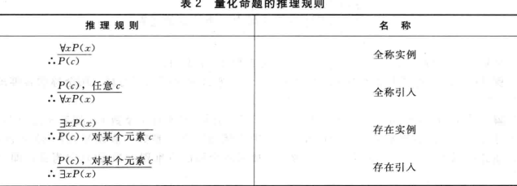

# 谓词与量词

# 为什么引入谓词逻辑?

命题逻辑中命题是以整个语句为最小单位的. 有些语句不能用命题精确表达.

如:

* 含有变量的语句
  *  "$3 + x = 5$"
  *  "$a^2 + b^2 = c^2$"
*  含有数量限定性定语的语句
   *  "所有学生都来上课了"
   *  "有的西瓜是黄瓢的"

# 谓词逻辑

对于**含有变量**的语句, 引入描述属性的逻辑形式--谓词(predicate).

谓词引入后, 便可以以变量变量作为参数, 命题作为其值来进行描述.

即谓词是一个命题函数(命题工厂).

# 含量词公式的否定式

* $\lnot \forall xP(x) \equiv \exist x \lnot P(x)$
* $\lnot \exist xP(x) \equiv \forall x \lnot P(x)$

# 例题

"在正整数n和2n之间存在质数" (定义谓词$N(x): x是正整数; y|x: y可整除x$)

$$
\forall n (N(n) \to (\exist x (N(x) \land n\leq x\leq 2n \land \forall y(y|x \to (y = 1 \lor y = x)))))
$$

存在式最好不要用蕴涵,

全称式最好用蕴涵.

个人理解: 

用枚举所有论域元素带入谓词来理解$\forall$与$\exist$.

$\forall$是用$\land$来连接各个元素,  
$\exist$是用$\lor$来连接各个元素

# 含量词的推理规则 (自然推理系统)

* 全称示例(UI): $\forall xP(x) \Rightarrow P(c)$
* 全称生成(UG): 对任意c有$P(x) \Rightarrow \forall xP(x)$
* 存在示例(EI): $\exist xP(x) \Rightarrow 对 P(c)$
* 存在生成(EG)

# 逻辑推理系统

# 例子

# 谓词逻辑系统性质与应用

