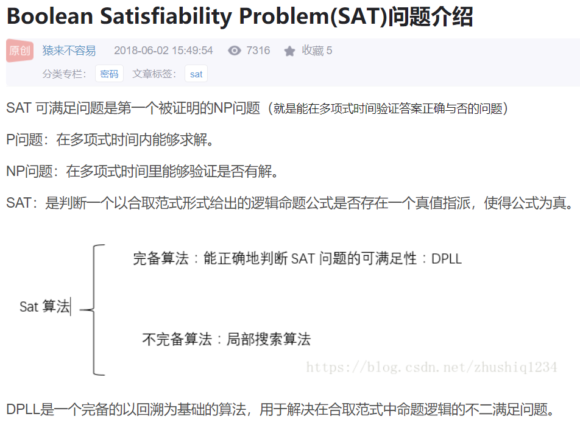
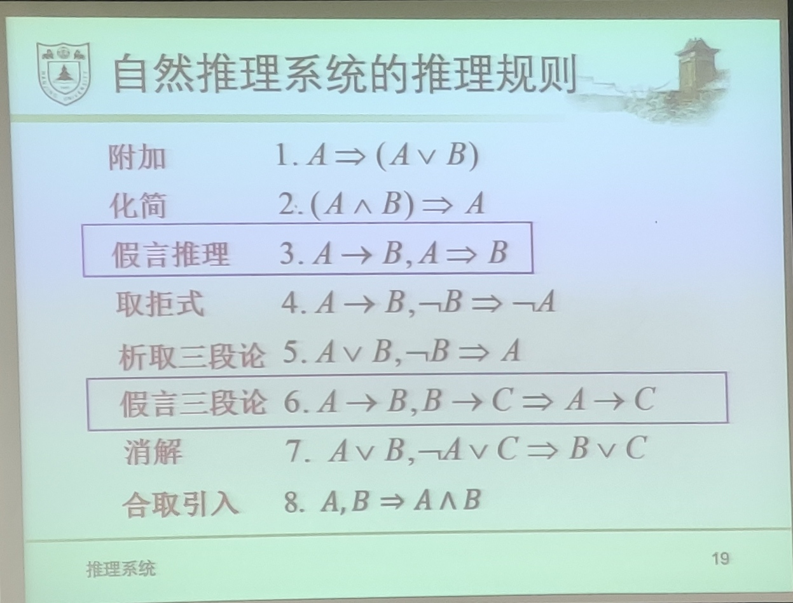
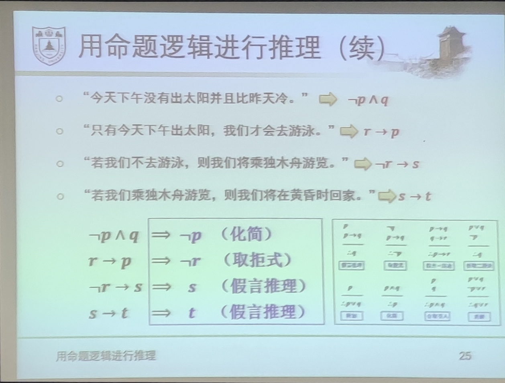
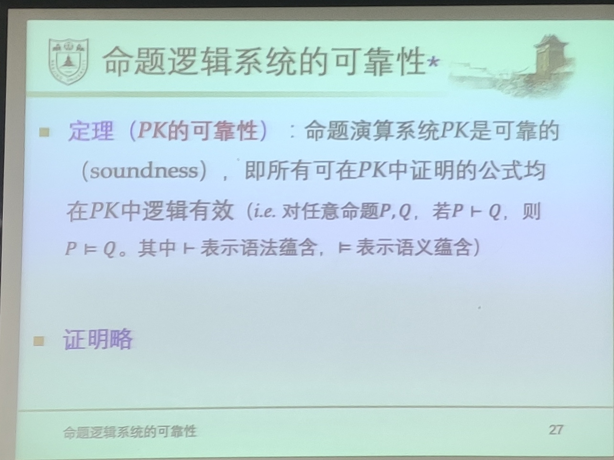

# 推理规则

## SAT

## 可满足性

一个命题存在一系列变元赋值使其取值为真, 称为**可满足性**.

若全为假, 则这个命题是**不可满足的**.

# 逻辑演化

* 柏拉图
* 亚里士多德
* 欧几里得 (阿基米德)
* 莱布尼茨 (Leibniz)
* 布尔 (Boole)
* 弗雷格 (Frege)

# 逻辑推理

* 在哲学中, 推理(inference)是"使用理智从某些**前提**长产生**结论**的行动"
* 在逻辑中, 推理(deduction)是指通过一个或多个**前提条件**(premise)获得**逻辑结论**(定论)的过程
* 主要推理方式: **归纳**, **演绎**和**溯因**的过程

## 归纳推理

通过(大量的)**前提条件**和**结果**来学习**规则**的推理方式称归纳推理(inductive reasoning), 归纳推理用来**决定规则**, 进而产生**结论**(Theory).  
实验科学常用归纳推理.

Observation => Pattern => Tentative Hypothesis => Theory

## 演绎推理

通过**规则**和**前提条件**推出**结论**的推理方式称演绎推理(deductive reasoning), 演绎推理用来**决定结论**.  
数学常用演绎推理.

Theory => Hypothesis => Observation => Theory

## 溯因推理

通过**结论**和**规则**来支持**前提条件**从而**解释结论**的推理方式, 它用来**决定前提**.

# 命题逻辑的推理系统

逻辑上logicism, intuitionism和formulism是近乎同等的(除了排中律).

## 逻辑推理系统

利用逻辑系统中已有的**公理**或给定的**判定**及**推理规则**经过有限推理过程产生新的**结论**的系统.

## 公理推理系统

特点: 采用**大量的逻辑公理**和**很少的推理规则**, 得到的结论是系统中的**重言式**, 称为系统中的**定理**(theorem)

### 定义(定理): 

* 每个公理都是定理
* 若公式 $A$ 和公式 $A \to B$ 皆为定理, 则 $B$ 是定理
* 每个定理都仅可通过有穷次(1)和(2)得到

## 公理推理系统一个例子

## 自然推理系统

特点: 由**很少的公理**(甚至无公理)和**大量的推理规则**构成

## 自然推理系统的推理规则

## 命题逻辑系统的完备性

## 命题逻辑系统的可靠性

# 谬误

## 肯定结论的谬误

即逆命题

## 否定假设的谬误

即否命题