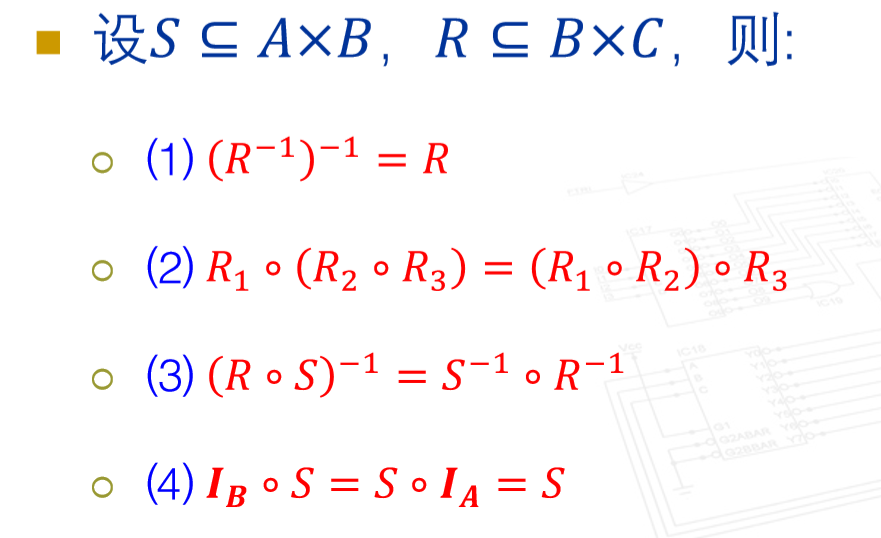
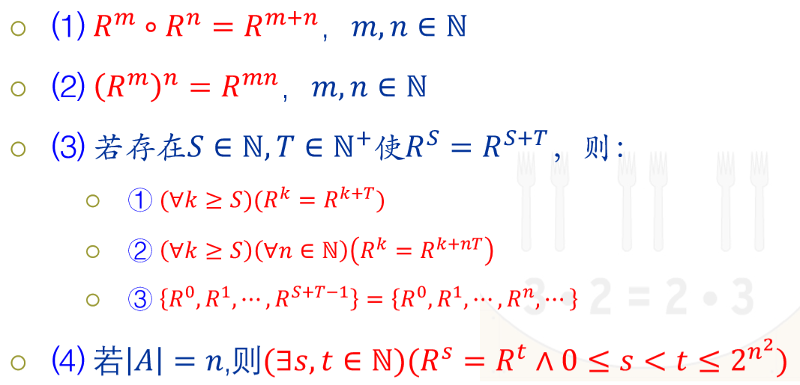

# 二元关系

# 引子: 集合与关系

因为集合中的元素的无序性, 但是现实世界存在大量的**有序关系**, 这就需要在集合论的基础上建立一种**描述"序"的模型**.

# 有序对

**序**(order)是一个非常基础的数学概念, 它刻画出对象的**可比性**. 最简单的序关系可以通过**有序对**(ordered pair, 或称**序偶**)来定义.

## 定义

$设a, b为对象, 二元运算(a, b)称为a与b的有序对指(a, b)= (c,d)\Leftrightarrow (a=c \land b=d). 这里称a为(a, b)的第一分量, 称b为(a,b)的第二分量.$

$令(a, b)=\{{a}, \{a, b\}\}$

## 证明:

### $\Leftarrow$:

显然.

### $\Rightarrow$:

## 其他序偶定义

* $\{\{\{a\}, \empty\}, \{\{b\}\}\}$
* $\{\{a,1\},\{b, 1\}\}$
* $\{a,\{a,b\}\}$

# 笛卡尔积

$任给集合A与B, 令A\times B=\{(a,b)|a\in A \land  b\in B\}$

$A\times B$称为$A$与$B$的笛卡尔积 (Cartesion Product)

$若A,B是有限集, 则|A\times B|=|A|\cdot |B|$

## 性质

* $A\times \empty=\empty \times A = \empty$
* $A\times B=B\times A \Leftrightarrow [(A=\empty)\lor (B=\empty) \lor (A=B)]$
* 分配律
  * $A\times(B\cup C)=(A\times B)\cup(A\times C)$
  * $A\times(B\cap C)=(A\times B)\cap(A\times C)$
  * $(B\cup C)\times A=(B\times A)\cup(C\times A)$
  * $(B\cap C)\times A=(B\times A)\cup(C\times A)$

# 关系

集合𝑅为关系指:

$$
∀(𝑟∈𝑅)(∃𝑥,𝑦)(𝑟=(𝑥,𝑦))
$$

# ⼆元关系

$设𝐴,𝐵为集合，若𝑅⊆𝐴×𝐵， 称𝑅为从𝐴到𝐵的二元关系，当𝐴=𝐵时，称𝑅为𝐴 上的二元关系，在无歧义时一般可简称关系$

# 相关记号

$设R\subseteq A\times B$

* $(a, b)\in R 可简记为aRb$
* $(a, b)\not\in R 可简记为\lnot aRb$
* $aRb \land bRc 可简记为aRbRc$

# 特殊关系

* 空关系(empty relation)$\mathbf{\empty}: \empty \subseteq A\times A$
* 全关系(entire relation)$\mathbf{E_A}: E_A\{(x,y)|x,y\in A\}$
* 恒同关系(identical relation)$\mathbf{I_A}: I_A \{(x,y)|x,y\in A\}$

# 自然数$\mathbb{N}$上常见关系

* 小于关系: $< \quad \stackrel\mathrm{def}= \quad \{(n,m)|n<m\land n,m\in \mathbb N\}$
* 大于关系: $> \quad \stackrel\mathrm{def}= \quad \{(n,m)|n>m\land n,m\in \mathbb N\}$
* 整除关系: $| \quad \stackrel\mathrm{def}= \quad \{(n,m)|n|m\land n,m\in \mathbb N\}$
* 相等关系: $| \quad \stackrel\mathrm{def}= \quad I_\mathbb{N}$

# 关系$R$有关的重要集合

$设R\subseteq A\times B$

* R的定义域 $\text {Dom}(R)=\{x|(\exist y\in B)(x,y)\in \mathbf R\}$
* R的值域 $\text {Ran}(R)=\{x|(\exist y\in A)(x,y)\in \mathbf R\}$
* R的域 $\text {Fld}(R)=\text {Dom}(R)\cup \text {Ran}(R)$

# 矩阵表示

$对于R\subseteq A\times B, 我们以集合表示之,$
$当R为有穷集时, 还可以用矩阵或有向图来表示二元关系.$

## 定义

$设A=\{a_1,a_2,\cdots,a_m\}与B=\{b_1,b_2,\cdots,b_n\}分别为m元与n元集,$
$R\subseteq A\times B为A到B的二元关系, 可由m\times n的矩阵M_R表示关系R,$
$M_R=[m_{ij}]_{m\times n}定义如下, 称为关系矩阵:$

$$
m_{ij}=
\begin{cases}
1, \qquad 若(a_i,b_j)\in R\\
0, \qquad 若(a_i,b_j)\not\in R
\end{cases}
$$

如

$$
\begin{pmatrix}
1 &0 \\
0 &1 \\
1 &0 \\
\end{pmatrix}
$$

# 逆

$设R\subseteq A\times B, R的逆(\text{inverse})为$

$$
R^{-1}=\{(x,y)|(y,x)\in R\}
$$

$易见, R^{-1}为从B到A的关系: R^{-1}\subseteq B\times A$

# 复合

$设S\subseteq A\times B, R\subseteq B\times C, R与S的复合为$

$$
R \circ S = \{(x,y)|(\exist t\in B)((x,t)\in S\land (t,y)\in R)\}
$$

事实上,

$$
x(R\circ S)y \Leftrightarrow \exist t(xStRy)
$$

$R\circ S 为从A到C的关系$.

## 运算法则

# 关系的幂

## 运算法则

证明: 鸽笼原理.