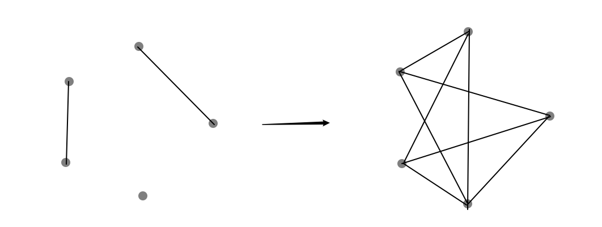
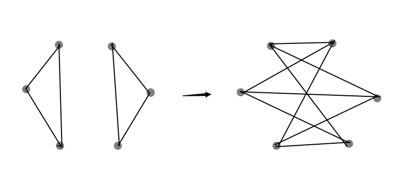

# Problem Set 20A

# Problem 1

$已知完全二部图中V_1中的点的度均为n, V_2中的点均为m$

(1) $当m和n均为偶数的时候K_{m,n}具有欧拉回路$

(2) $当m和n均为偶数, 或m和n其中一个是2的时候具有欧拉通路$

# Problem 2

$要使含有k个奇数度的结点的连接图G成为欧拉图,$
$即要让这k个奇数度节点都变成偶数度节点$

$让我们考虑在G中加入一条边会发生什么:$

$若这条加入的边连接的是两个奇数度节点,$
$那么这两个奇数度节点都会变成偶数度节点, 即奇数节点减二, 偶数节点加二$

$若这条加入的边连接的是两个偶数度节点,$
$那么这两个偶数度节点都会变成奇数度节点, 即偶数节点减二, 奇数节点加二$

$若这条加入的边连接的是一个奇数度节点和一个偶数度节点,$
$那么奇数度节点数和偶数度节点数均不变$

$\therefore 我们可知, 奇数度节点数每次都以2为最小变化量变化,$

$当k为奇数时, 不可能让k个奇数度节点都变成偶数度节点$

$当k为偶数时, 设这k个奇数度点为v_1, v_2,\cdots ,v_{k}$

$加入边v_1v_2, v_3v_4,\cdots ,v_{k-1}v_k, 那么这k个奇数度点都变成了偶数度点$

$一共加入了\displaystyle\frac{k}{2}条边, 此时已经成为了欧拉图$

$易知如果加入的边数少于\displaystyle\frac{k}{2}, 则必定会剩余若干个奇数度点, 不可能为欧拉图$

$\therefore 图G中至少要添加\displaystyle\frac{k}{2}条边才能变为欧拉图$

# Problem 3

## (1)

$反驳, 如图:$

## (2)

$反驳, 如图:$

# Problem 4

$对于r-正则图G中的任意一条边e, 有端点u, v$

$\therefore 顶点u与r条边相连, 除去边e则还与r-1条边相连$
$\quad 且这r-1条边的顶点不包含v$

$\therefore 顶点v也还与r-1条边相连, 这r-1条边与u的r-1条边不重合$

$\therefore 边e与2(r-1)条边相邻$

$\therefore L(G)中的任意点与2(r-1)点相邻, 即度数为2(r-1), 为偶数$

$\therefore 由欧拉图判定定理可知, L(G)是欧拉图$

$反之不一定成立, 如图:$

