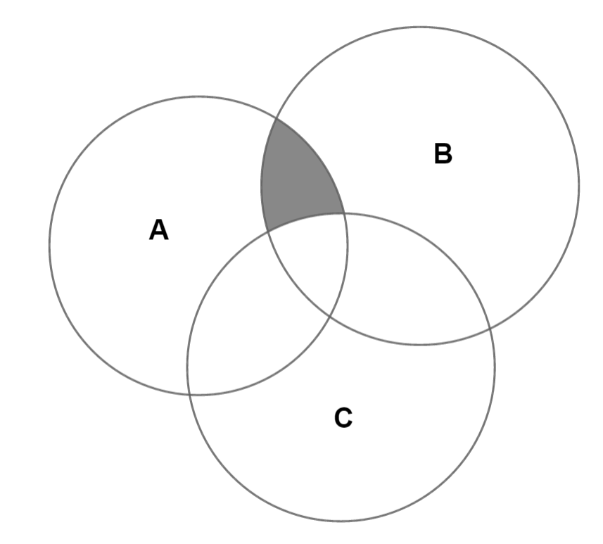
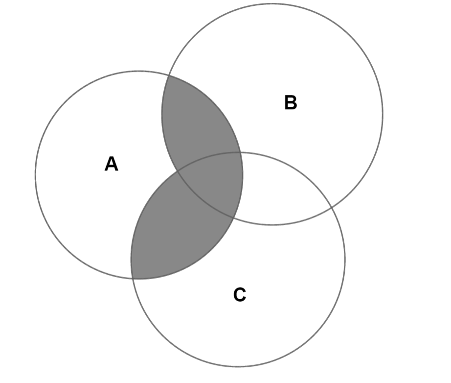

# Problem Set 5 Ans

# Problem 1

## a)

$命题为假.$

$例如A=\{1,2,3\},B=\{2, 3\},C=\{3,4\}时,$

$有A\cap C= B\cap C = \{3\}, 但A\neq C$

## b)

$命题为假.$

$例如A=\{1,2,3\},B=\{3,4\},C=\{2, 3, 4\}时,$

$有A\cup B= A\cup C=\{1,2,3,4\}, 但B\neq C$

## c)

$命题为假.$

$例如A=\{1\},B=\{2\}时,$

$\therefore 2^{A\cup B}=\{\{1\},\{2\},\{1,2\}\}$

$\therefore 2^{A}\cup 2^{B}=\{\{1\}\}\cup\{\{2\}\}=\{\{1\},\{2\}\}$

## d)

$命题为真.$

$
\begin{aligned}
2^{A\cap B} &= \{x|x\subseteq A\cap B\} \\
&= \{x|\forall y(y \in x \to y\in A \cap B)\} \\
&= \{x|\forall y(y \in x \to y\in A \land y\in B)\} \\
&= \{x|\forall y(y \not\in x \lor (y\in A \land y\in B))\} \\
&= \{x|\forall y((y \not\in x \lor y\in A) \land (y \not\in x \lor y\in B))\} \\
&= \{x|\forall y((y \in x \to y\in A) \land (y \in x \to y\in B))\} \\
&= \{x|\forall y(y \in x \to y\in A) \land \forall y(y \in x \to y\in B)\} \\
&= \{x|x \subseteq A \land x \subseteq B\} \\
&= \{x|x\in \{x|x\subseteq A\} \land x\in \{x|x\subseteq B\}\} \\
&= \{x|x \in 2^A \land x \in 2^B\} \\
&= 2^A\cap 2^B \\
\end{aligned}
$

$\therefore 2^{A\cap B}=2^A\cap 2^B$

# Problem 2

### 结论: 

$A=\empty 或 B=\empty$

### 证明:

$\because A\times B=\empty$

$\therefore A\times B=\{(x, y)|x \in A \land y \in B\}=\empty$

$\therefore \exist x \exist y(x \in A \land y \in B) \equiv F$

$\therefore \forall x \forall y(x \not\in A \lor y \not\in B) \equiv T$

$\therefore 不存在x\in A或不存在y\in B$

$\therefore A=\empty 或 B=\empty$

# Problem 3

a) $\{-1, 0, 1\}$

b) $\empty$

# Problem 4

## a)

$
\begin{aligned}
A-B &= \{x|x \in A \land x \not\in B\} \\
&= \{x|x \in A \land x \in \overline{B}\} \\
&= A \cap \overline{B}
\end{aligned}
$

## b)

$(A\cap B)\cup (A\cap \overline{B})=A\cap(B\cup \overline{B})=A$

# Problem 5

## a)

$不能.$

$例如A=\{1,2,3\},B=\{1,2\},C=\{3,4\}时,$

$有A\cup C= B\cup C=\{1,2,3,4\}, 但A\neq B$

## b)

$不能.$

$例如A=\{1,2,3\},B=\{2, 3\},C=\{3,4\}时,$

$有A\cap C= B\cap C = \{3\}, 但A\neq B$

## c)

$能.$

# Problem 6

$
\begin{aligned}
A\subseteq B &\equiv \forall x(x\in A\to x\in B)\\
&\equiv \forall x(x\not\in B\to x\not\in A)\\
&\equiv \overline{B} \subseteq \overline{A}\\
\end{aligned}
$

$\therefore A\subseteq B \equiv \overline{B} \subseteq \overline{A}$

# Problem 7

## a) 

$A \oplus A=(A-A)\cup(A-A)=\empty$

## b)

$A \oplus U = (A \cup U)-(A \cap U) =U-A=\overline{A}$

# Problem 8

## a)

$\because A_i=\{1,2,3,\dots,i\}, i=1,2,3,\dots$

$\therefore 当i\geq 2时, A_{i-1}\subseteq A_i, A_{i-1}\cup A_i=A_i$

$\therefore \displaystyle\bigcup _{i=1}^n A_i=A_n=\{1,2,3,\dots,n\}$

## b)

$\because A_i=\{1,2,3,\dots,i\}, i=1,2,3,\dots$

$\therefore 当i\geq 2时, A_{i-1}\subseteq A_i, A_{i-1}\cap A_i=A_{i-1}$

$\therefore \displaystyle\bigcup _{i=1}^n A_i=A_1=\{1\}$

# Problem 9

$
\begin{aligned}    
(A-B)\oplus B&=((A-B)\cup B)-((A-B)\cap B) \\
&=A\cup B - \empty \\
&=A\cup B
\end{aligned}
$

$\therefore (A-B)\oplus B = A \cup B$

# Problem 10

## a)

$A \cap (B - C)$

## b)

$(A \cap \overline B) \cup (A \cap \overline C)$

## c)

$(A \cap B) \cup (A \cap C)$

