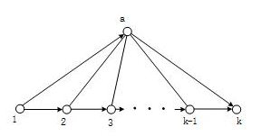
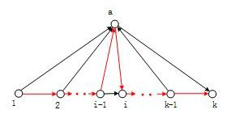
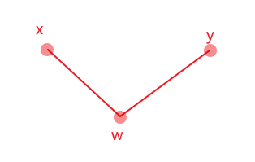

# 2019-2020年第一学期人工智能学院离散数学期末考试试卷参考答案

# 一

$定义谓词:$

$C(x):x是猫$
$D(x):x是狗$
$R(x):x能抓住老鼠$
$将南大神兽记为n$

$则原题转换为证明:$

$
\begin{aligned}
&R(n) \\
&\forall x(C(x)\leftrightarrow R(x)) \\
&\underline{\forall x(D(x)\to \lnot R(x))} \\
\therefore \ 
&C(n)\land\lnot D(n)
\end{aligned}
$

#### 证明:

$
\begin{aligned}
&(1)\quad D(n)\to\lnot R(n) &(全称实例) \\
&(2)\quad R(n) &(前提) \\
&(3)\quad \lnot D(n) &(取拒式,由(1)(2)) \\
&(4)\quad C(n)\leftrightarrow R(n) &(全称实例) \\
&(5)\quad C(n)\rightarrow R(n)\land R(n)\rightarrow C(n) &(等价等值式, 由(4)) \\
&(6)\quad R(n)\rightarrow C(n) &(化简, 由(5)) \\
&(7)\quad C(n) &(假言三段论, 由(2)(6)) \\
&(8)\quad C(n)\land \lnot D(n) &(合取引入, 由(3)(7)) \\
\end{aligned}
$

# 二

$将这六个人作为图的六个点, 两个点相邻当且仅当对应的两个人认识$

$问题可转化为, 一个阶数为6的图或补图, 总有三个顶点构成回路$

#### 证明:

$对6阶图G中任意一个点u, 若该点的度数\deg(u)\leq 2,$
$则在补图\overline{G}中u的度数大于等于3$

$\therefore 我们可知任意点u在原图或者补图中度数必然大于等于3$

$设点u相邻的这3个点为v_1,v_2,v_3$

$若其中至少两点相邻, 设为v_1v_2, 那么uv_1v_2u形成了一条回路$

$若其中三点均不相邻,$
$那么对于它的补图来说这三个点是相邻的, 构成v_1v_2v_3v_1回路$

$\therefore 任何6个人中, 总有3个人相互认识或者相互不认识$

# 三

## (1)

|xyz|000|001|010|011|100|101|110|111|
|---|---|---|---|---|---|---|---|---|
| t |000|001|010|011|100|101|111|110|

$由表格可知除了t(1,1,0)=(1,1,1)和t(1,1,1)=(1,1,0)以外,$
$其他时候自变量都等于对应函数值$

$并且我们可知t^{-1}(1,1,0)=(1,1,1), t^{-1}(1,1,1)=(1,1,0)$

$\therefore t^{-1}(x,y,z)=t(x,y,z)$

## (2)

$OR(x,y)=NOT(AND(NOT(x),NOT(y)))=\cdots $

$AND(x,y)=\prod_3(t(x,y,0))$

$XOR(x,y)=\prod_3(t(x,x,y))$

$NOT(x)=\prod_3(t(1,1,x))$

# 四

$对应为:$

| ← | → | ↑ | ↓ | ↔ | ↕ |
|---|---|---|---|---|---| 
|11 |01 |000|100|001|100|

$\therefore 2\times(31+19)+3\times(9+15+12+13)=247$

$\therefore 字符数为249或250个$

# 五

$设布尔代数B的原子集合为A, 那么由有限布尔代数表示定理可知:$

$即\langle B,\land,\lor,',0,1\rangle \simeq \langle \mathcal{P}(A),\cap, \cup, \sim,\empty, A\rangle $

$\therefore B中任一一个元素b, 均可以找到一个对于的a\in \mathcal{P}(A),$
$\quad 而a一定能由A表示出来,$

$全下界0对应的是\empty, 而a_1\cap a_2=\empty, 那么0=b_1\land b_2$

$而除了全下界0之外的任一元素, 设为b, 均有a与b对应,$
$且a\in \mathcal{P}(A), a\neq \empty, 即a是A的一个非空子集,$
$则a可以由一系列原子取并获得, 即a=\{c_i\}\cup\cdots \cup \{c_j\}, c_i\in A$
$\therefore b=\{c_i\}\lor\cdots \lor \{c_j\}, c_i\in A$

$\therefore 综上一个布尔代数可以被原子集合构造出来$

# 六

$费马小定理$

## 证法一

$要证a\equiv a^p \quad(mod \ p)$

$当p|a时, 易知该式成立$

$当p\not|\ a时,$

$\because a\equiv a^p \quad(mod \ p)\Leftrightarrow p|a^p-a\Leftrightarrow p|a^{p-1}-1\Leftrightarrow a^{p-1}\equiv 1 \quad(mod \ p)$

$即证a^{p-1}\equiv 1 \quad(mod \ p)$

$构造G=\langle[1],[2],\cdots ,[p-1], \equiv,*\rangle, 其中*为模p乘法$

$封闭性:$
$模p乘法的结果必为[0]到[p-1], 若[a][b]\not\in G, 则[a][b]=0$
$[a][b]=0\Rightarrow [ab]=0\Rightarrow p|ij,$
$但是(a,m)=1,(b,m)=1, 则(ab,m)=1, p\not|\ ab, 矛盾, 封闭性成立$

$交换律: 由模p乘法性质易得$

$单位元: 易知[1]是G的单位元$

$逆元:$
$对于G中任意一个元素[a], 我们可知(a,p)=1$
$\therefore \exist s,t使得as+pt=1, -pt=as-1$
$\therefore p|as-1$
$\therefore as\equiv 1\quad(mod \ p)$
$\therefore [as]=[a][s]=[1] \quad(mod \ p)$
$\therefore [a]存在逆元[s], 且易知m|s, 那么[s]\in G$

$\therefore G是一个阶数为p-1的群$

$由Lagrange定理可知对于G任意一个元素[a]来说,$
$假设[a]的阶数是d, 即[a]^d=[1], 那么必定有d|p-1, 即\exist t, dt=p-1$

$\therefore [a^{p-1}]=[a^{dt}]=([a]^{d})^t=([1])^t=[1]$

$\therefore a^{p-1}\equiv 1 \quad(mod \ p)$

$\therefore 综上a\equiv a^p\quad(mod \ p)$

## 证法二

$观察组合数\begin{pmatrix}p\\n\end{pmatrix}=\displaystyle\frac{p!}{n!(p-n)!}, p是质数,$

$若n\neq 0或n\neq p, 则分母中每一个数均与p互质,$
$没有可以消去分子中的p的数, 即\begin{pmatrix}p\\n\end{pmatrix}\equiv 0 \quad(mod \ p)$

$
\begin{aligned}
\therefore (b+1)^p
&\equiv\begin{pmatrix}p\\p\end{pmatrix}b^p+\begin{pmatrix}p\\p-1\end{pmatrix}b^{p-1}+\cdots +\begin{pmatrix}p\\0\end{pmatrix}b^0 \quad(mod \ p) \\
&\equiv\begin{pmatrix}p\\p\end{pmatrix}b^p+\begin{pmatrix}p\\0\end{pmatrix}b^0 \quad(mod \ p) \\
&\equiv b^p+1 \quad(mod \ p) \\
&\equiv (b-1)^p+2 \quad(mod \ p) \\
&\equiv \cdots \\
&\equiv (b-b+1)^p+b \quad(mod \ p) \\
&\equiv b+1 \quad(mod \ p) \\
\end{aligned}
$

$令b=a-1, 则有 a^p\equiv a\quad(mod \ p)$

## 欧拉定理

$对于m=1时, 任何数模1均为0, 不予考虑$

$对于m>1时,$

$构造G=\langle [a_1], [a_2], \cdots ,[a_{\varphi(m)}], \equiv, *\rangle,$
$其中[a_i]是模m剩余类, 且G中包含了所有与m互素的a_i, *是模m乘法$

$封闭性:$
$对于[a_i][a_j]=[a_ia_j], 我们有(a_i,m)=(a_j,m)=1\Rightarrow(a_ia_j,m)=1$
$\therefore [a_ia_j]在G里即[a_i][a_j]也在G里, G是封闭的$

$交换律: 由模m乘法性质易知成立$

$单位元: 易知[1]\in G 是单位元$

$逆元:$
$对于任意[a]\in G, (a,m)=1\Rightarrow \exist s,t, as+mt=1\Rightarrow -mt=as-1$
$\therefore m|as-1\Rightarrow [as]=[a][s]=[1]$
$\therefore [a]存在逆元[s]$
$假设m|s, 那么s=ms', as+mt=m(as'+t)=1$
$\therefore m=1, 与m>1矛盾, m|s不可能成立$
$假设s|m, 那么m=sm', as+mt=s(a+m't)=1$
$\therefore s=\pm 1, (s,m)=1$
$\therefore 综上(s,m)=1, [s]\in G, [a]的逆元[s]存在$

$\therefore G是阶数为\varphi(m)的群$

$\therefore 由Lagrange定理可知,$
$任一满足(a,m)=1, 必有[a]\in G, 若a的阶是d即|a|=d, 则d|\varphi(m)$

$\therefore [a]^d=[1], \exist t,\varphi(m)=dt$

$\therefore [a^{\varphi(m)}]=[a^{dt}]=([a]^{d})^t=[1]^t=[1]$

$\therefore a^{\varphi(m)}\equiv 1 \quad(mod \ m)$

# 七

$要证\tau(G)=\tau(G\cdot e)+\tau(G-e)$

$\because 易知\tau(G)=\tau(G-e)+1$

$\therefore 即证\tau(G\cdot e)=1$

$???$

# 八

$设1\to k是竞赛图G中的一条极大路径, 长度为k, 但是k<n$

$那么在这条极大路径外有一点a, a和极大路径上的任一点都有边$

$若存在边a\to 1, 那么把a加入路径仍是路径, 极大路径假设不成立$

$\therefore 只能存在边1\to a, 同理只存在a\to k$

$观察点2到k, 假设i是第一个存在a\to i的点$
$(若2到k-1都不是, 那么k必然是这个点)$

$我们可知从i-1到i点, 走i-1\to a\to i比i-1\to i更长,$
$在路径中将前者替换后者, 能得到更长的路径, 极大路径假设不成立$

$\therefore 竞赛图中的极大路径必然包含所有点, 即哈密顿通路$

# 九

## (1)

## (2)

$若图G中包含子图C_4, 即有一条初级回路c_0c_1c_2c_3c_0$

$那么我们可知, c_0c_1相邻, c_0c_3相邻, c_2c_1相邻, c_2c_3相邻$

$\therefore c_0和c_2的公共顶点有c_1和c_3, 多于一个公共顶点$

$\therefore G不是友谊图$

## (3)

$题目修改为任意两个不相邻的顶点度数相等$

$对于任意两个不相邻的顶点x,y, 它们的公共顶点为w$

$先证\deg(x)\leq \deg(y):$

$设S为与x相邻的顶点集合,$
$Q为S中任意一点与y点的公共顶点的集合$

$\because S中任意点都与x相邻, 可知x为S任意两点的唯一公共顶点$

$\therefore S中有两点u,v, 假设u,y和v,y的公共点是同一个$

$\therefore 这个公共点即是x, 但x与y不相邻, 假设不成立,$
$\quad 可知S中任意两点与y的公共点不同$

$\therefore S\approx Q$

$\therefore \deg(x)=|S|=|Q|\leq \deg(y)$

$同理可证\deg(y)\leq \deg(x)$

$\therefore \deg(x)=\deg(y)$

