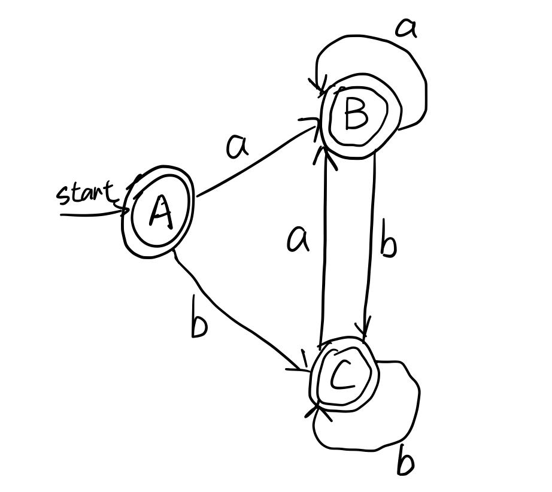

# 编译原理第二次作业

## 201300035 方盛俊

## Ex. 3.7.3 (2)

将正则表达式 `(a*|b*)*` 转为 NFA 有:

通过子集构造法将 NFA 转换为 DFA 有:

- A: ε-closure(0) = { 0, 1, 2, 3, 4, 6, 7, 9, 10, 11 }
- B: Dtran[A, a] = ε-closure(move(A, a)) = ε-closure({ 5 }) = { 1, 2, 3, 4, 5, 6, 7, 9, 10, 11 }
- C: Dtran[A, b] = ε-closure(move(A, b)) = ε-closure({ 8 }) = { 1, 2, 3, 4, 6, 7, 8, 9, 10, 11 }
- Dtran[B, a] = ε-closure({ 5 }) = B
- Dtran[B, b] = ε-closure({ 8 }) = C
- Dtran[C, a] = ε-closure({ 5 }) = B
- Dtran[C, b] = ε-closure({ 8 }) = C

则有 DFA:

- 开始状态: A
- 接受状态: A, B, C

| NFA 状态                           | DFA 状态 | a   | b   |
| ---------------------------------- | -------- | --- | --- |
| { 0, 1, 2, 3, 4, 6, 7, 9, 10, 11 } | A        | B   | C   |
| { 1, 2, 3, 4, 5, 6, 7, 9, 10, 11 } | B        | B   | C   |
| { 1, 2, 3, 4, 6, 7, 8, 9, 10, 11 } | C        | B   | C   |

作图即可得:

## Ex. 4.2.1

**(1)**

