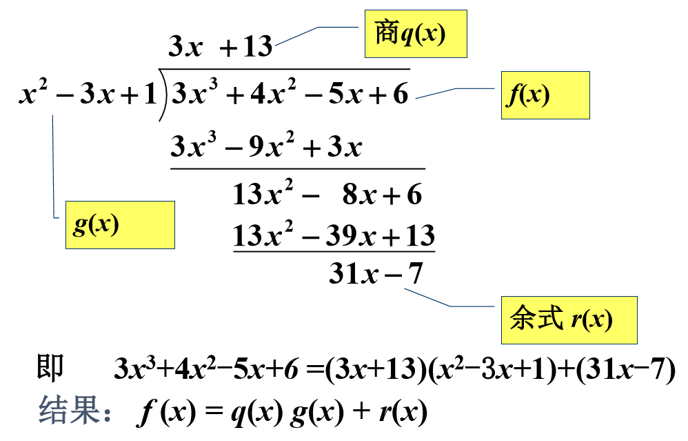
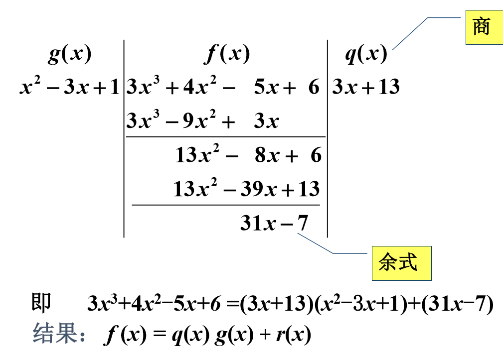
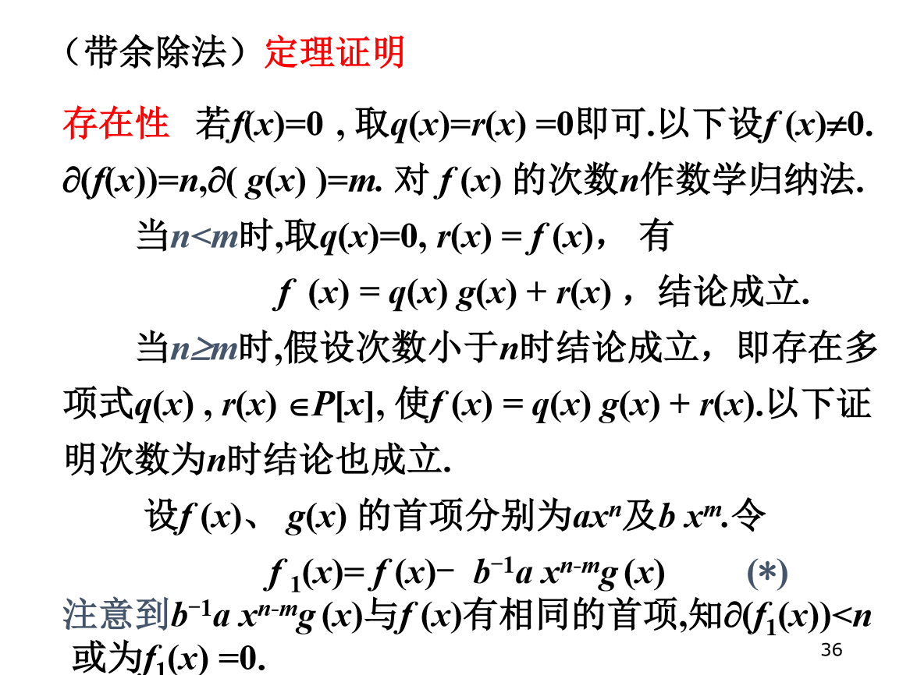
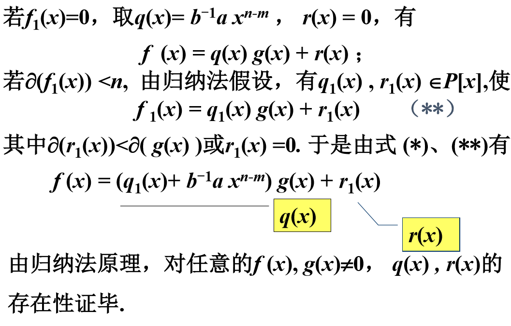
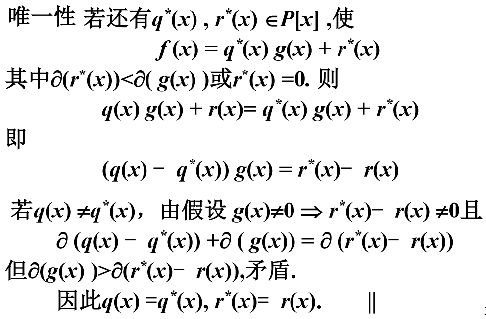

# 整除的概念

# 引言

在一元多项式环 $P[x]$ 中,有 $f(x)±g(x),f(x)g(x)$ . 是否有除法？应该如何描述 $P[x]$ 中两个多项式相 除的关系？两个多项式除法的一般结果是什么？

# 带余除法

## 长除法

## 竖式除法

## 定理

设$f(x), g(x) \in P[x], g(x) \neq 0$, 则**存在唯一**的多项式$q(x), r(x)\in P[x]$, 使得

$$
f(x) = q(x)g(x) + r(x)
$$

其中 $r(x)=0$ 或 $\partial(r(x))<\partial(g(x))$

称上式中$q(x)$为$g(x)$除$f(x)$的**商**, $r(x)$为$g(x)$除$f(x)$的**余数**

## 证明

# 整除的定义

设$f(x), g(x) \in P[x]$, 如果存在多项式$h(x) \in P[x]$

使得

$$
f(x) = h(x)g(x)
$$

称$g(x)$整除$f(x)$(或$f(x)$能被$g(x)$整除)， 记为$g(x)|f(x)$,  
此时称$g(x)$为$f(x)$的**因式**， $f(x)$为$g(x)$的**倍式**.

等价为:

$g(x)$除$f(x)$的余式为零.

正确例子:

* $2|3$
* $f(x)|0$

