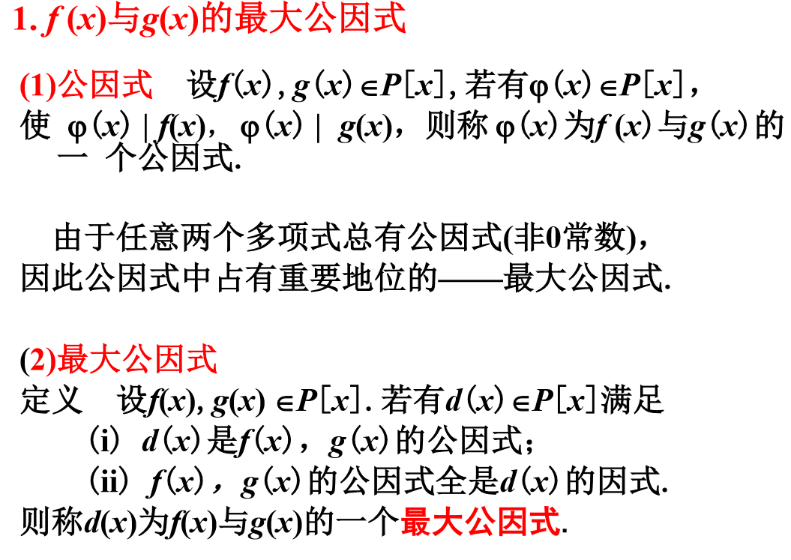
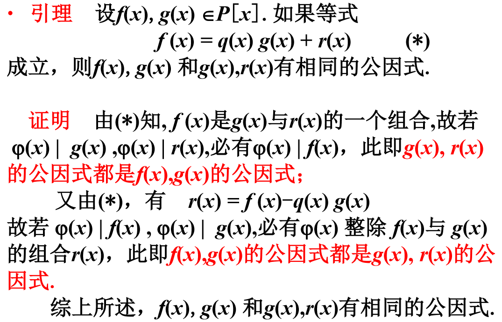

# 最大公因式

# 说明

## 最大公因式再相差一个非零常数的意义下是唯一确定的

事实上, 若$d_1(x), d_2(x)$是$f(x), g(x)$的最大公因式, 由最大公因式定义, 知

$$
d_1(x)|d_2(x), d_2(x)|d_1(x)
$$

可得

$$
d_1(x)=cd_2(x)
$$

## 记法

记$(f(x), g(x))$为$f(x)$和$g(x)$的首项为$1$的最大公因式.

# 例题

若$\{f(x),g(x)的公因式\}=\{p(x),q(x)的公因式\}$

那么$\{f(x),g(x)的最大公因式\}=\{p(x),q(x)的最大公因式\}$

即$(f(x),g(x))=(p(x),q(x))$

## 证明:

$设c(x)是f(x),g(x)的最大公因式, 则c(x)也是p(x),q(x)的最大公因式.$

$p(x),q(x)的因式都能在f(x), g(x)找到相同的因式, 所以c(x)能被所有因式整除.$

$c(x)是p(x),q(x)的最大公因式.$

# 最大公因式的存在及其求法 (辗转相除法)

