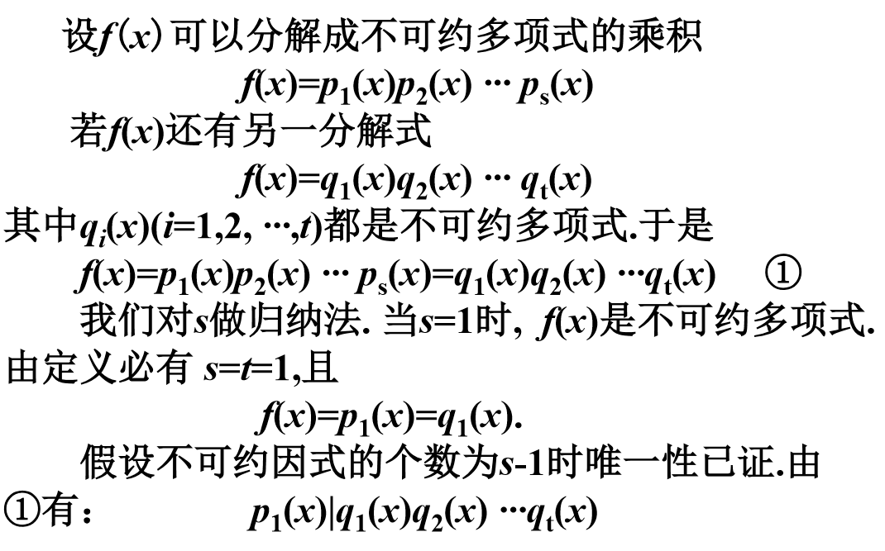
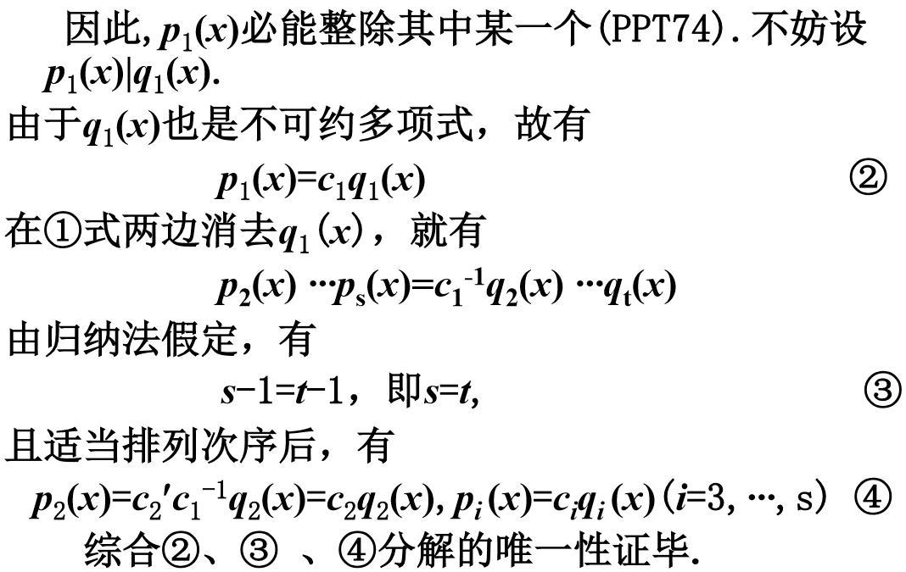

# 因式分解定理

# 不可约多项式概念, 性质

## 定义1

如果数域$P$上次数大于0的多项式$p(x)$不能表示成数域$P$上的两个次数比$p(x)$的次数低的多项式的乘积,称其为域$P$上的不可约多项式.

* 一次多项式总是不可约多项式 
* 多项式是否可约依赖于数域, 如$f(x)= x^2+2$在实数域上不可约, 在复数域上 可约
* 不可约多项式$p(x)$的因式只有$c$及$cp(x)(c ≠0)$

## 定义2

对于$P[x]$中的一个次数大于0的多项式$f(x)$, 如果在$P[x]$中的因式只有$P[x]$中非零数和$f(x)$的相伴式, 则称$f(x)$是$P[x]$上的不可约多项式.

## 定义3

$设f(x)\in P[x], \partial(f(x))>0, 若\exist g(x), h(x)\in P[x]$

$\Rightarrow f(x)=g(x)h(x), 其中\partial(g(x))<\partial(f(x))且\partial(h(x))<\partial(f(x))$

则称$f(x)$在$P$上可约, 否则称$f(x)$为不可约多项式.

## 性质

如果$p(x)$是不可约多项式，则

* $\forall f(x)\in P[x],或者p(x)|f(x), 或者 f(x)与p(x)互素$
* $\forall f(x),g(x)\in P[x]$, $由p (x)|f(x)g(x)一定推出 p (x)|f (x)或者p (x)|g (x)$ 

# 因式分解及唯一性定理

## 存在性:

数域$P$上每一个次数大于0的多项式$f(x)$都可以唯一地分解成数域$P$上一些不可约多项式的乘积.

## 唯一性:

若有两个分解式 $f(x)=p_1(x)p_2(x)\cdots p_s(x)=q_1(x)q_2(x) \cdots q_t(x)$ 则必有$s=t$，且适当排列因式的次序后有 $p_i(x)=c_iq_i (x)，i=1,2,\cdots,s$ 其中，$c_i (i=1,2,\cdots,s)$是一些非零常数.

## 存在性证明:

用数学归纳法.

(1) 当 $i=1$ 时, 一次多项式都是不可约多项式.

(2) 假设 $i<n$ 时 $f_1(x)$, $f_2(x)$ 可分解, $f(x)=f_1(x)f_2(x)$ 也可分解.

(不完整)

## 唯一性证明:

# 多项式因式分解的标准形式

在$f(x)$的分解式中, 可以把每一个不可约因式的首项系数提出来,使其成为首项系数为1的多项式, 再将相同的不可约因式合并, 于是有

## 标准分解式

$$
f(x)=cp_1^{r_1}(x)p_2^{r_2}(x)\cdots p_s^{r_s}(x)
$$

, 其中$c$为$f(x)$的首项系数,$p_i(x)(i=1,2,…,s)$是不同的首项系数为1的不可约多项式,$r_i (i=1,2,…,s)$为正整数.

## 性质

$设f(x)=cp_1^{a_1}(x)p_2^{a_2}(x)\cdots p_m^{a_m}(x)$

$\quad g(x)=dp_1^{b_1}(x)p_2^{b_2}(x)\cdots p_m^{r_m}(x)$

$对任意的i(1\leq i \leq m)都有a_i\geq 0, b_i\geq0, a_i+b_i>0,有:$

### (1)

$f(x)|g(x) \Leftrightarrow a_i \leq b_i$

$g(x)|f(x) \Leftrightarrow b_i \leq a_i$

### (2)

$(f(x), g(x))=p_1^{c_1}(x)p_2^{c_2}(x)\cdots p_m^{c_m}(x), c_i=\min\{a_i, b_i\}$

### (3)

$[f(x), g(x)]=p_1^{d_1}(x)p_2^{d_2}(x)\cdots p_m^{d_m}(x), d_i=\max\{a_i, b_i\}$

### (4)

$(f(x), g(x))[f(x), g(x)]=c^{-1}d^{-1}f(x)g(x)$

## 注意:

* 一般地, 没有将一个多项式分解成标准分解式的有效方法
* 甚至判断一个多项式是否可约也是困难的

