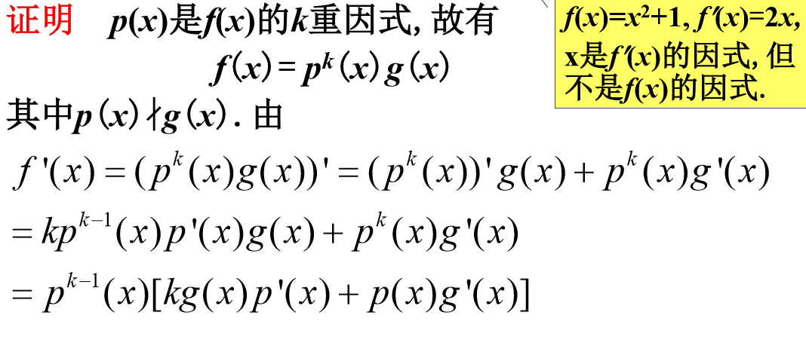

# 重因式

# 定义

$p(x)为不可约多项式, 如果p^k(x)|f(x),而p^{k+1}(x)\not|f(x),$ 
$称p(x)为多项式f(x)的k重因式.$

$若k=0,p(x)根本不是f(x)的因式;$
$若k=1,p(x)称为f(x)的单因式;$
$若k>1,p(x)称为f(x)的重因式.$

## 注意

许多问题中,要求所讨论的多项式没有重因式, 多项式的近似求根法也要求所考虑的多项式没有重 根.因此判别多项式有无重因式、求其重因式及去 掉重因式是我们必须要考虑的问题

# 重因式判别

## 微商(导数)概念

$设有多项式f(x)=a_nx^n+a_{n-1}x^{n-1}+\cdots+a_ix^i+\cdots+a_1x+a_n$

$其中微商(导数)规定为:$

$f'(x)=na_nx^{n-1}+(n-1)a_{n-1}x^{n-2}+\cdots+ia_ix^{i-1}+\cdots+a_1$

## 微商(导数)性质

* $(f(x)+g(x))'=f'(x)+g'(x)$
* $(cf(x))'=cf'(x)$
* $(f(x)g(x))=f'(x)g(x)+f(x)g'(x)$
* $(f^m(x))'=mf^{m-1}(x)f'(x)$

## 重因式判定

$如果不可约多项式p(x)是f(x)的k重因式(k≥1),$

$则它是微商f'(x)的k-1重因式.反之不然.$

### 证明:

# 推论

## 推论1

$如果不可约因式p(x)是f(x)的k(k ≥ 1)重因式,$
$那么p(x)分别是f'(x),f''(x),…,f^{(k-1)}(x)的k-1,k-2,…,1 重因式,$
$而不是f(k)(x)的因式.$

$特别地,f(x)的单因式不再是f'(x)的因式.$

## 推论2

$不可约多项式p(x)是f(x)的重因式的\Leftrightarrow p(x)是f(x)与f'(x)的公因式.$

## 推论3

$多项式f(x)没有重因式\Leftrightarrow 是f(x)与f'(x)互素.$

## 推论4

$设数域F[x]包含数域P[x],$
$对于P[x]中次数大于0的多项式f(x),$
$f(x)在P[x]中没有重因式.$

$\Leftrightarrow$

$f(x)在F(x)中没有重因式, 即f(x)有无重因式不随着数域的扩大而改变.$