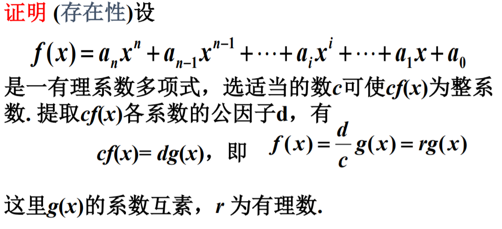
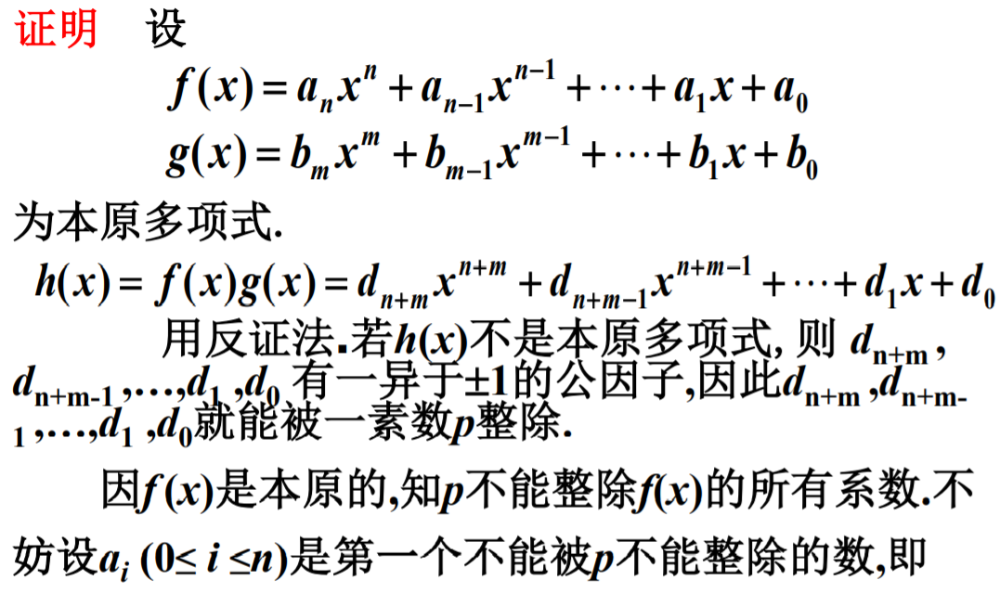
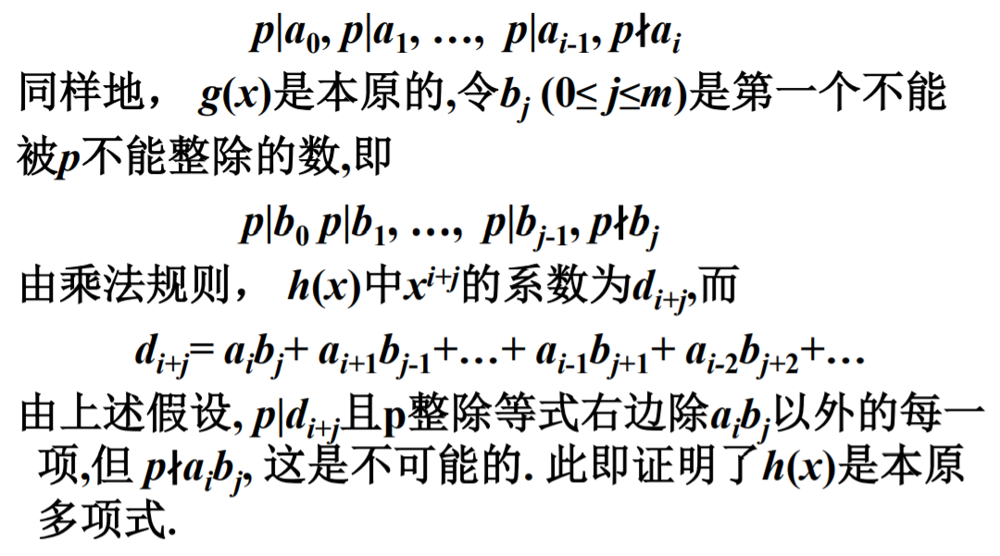
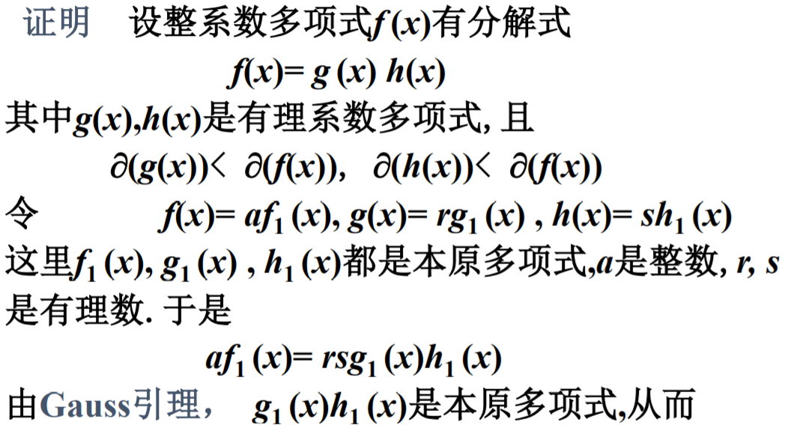
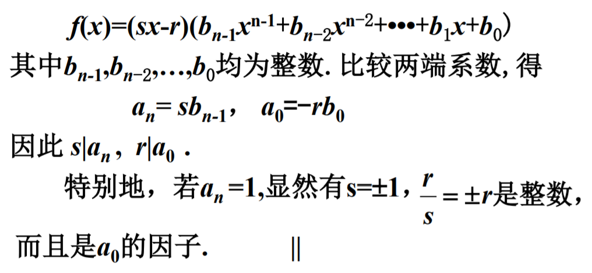
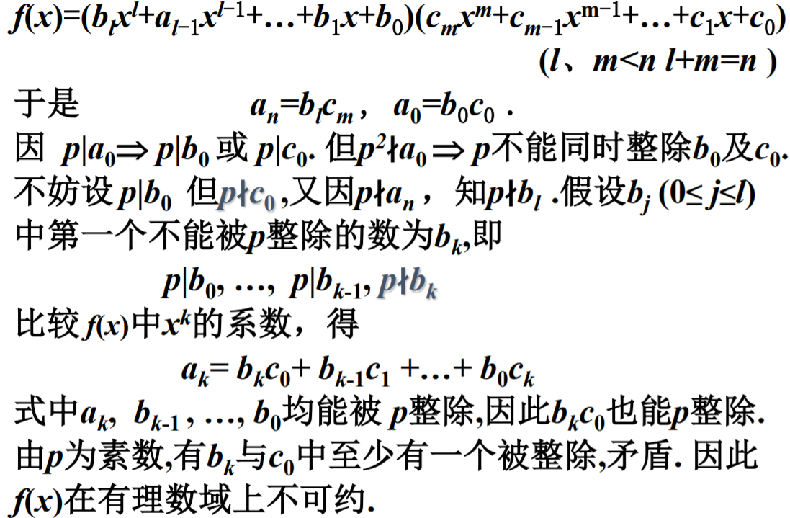

# 有理系数多项式

# 与整系数多项式的关系

$设f(x)\in Q[x], 记f(x)的系数的公分母是d,$
$则df(x)是整系数多项式.$

$p(x)\in P[x], p(x)是不可约多项式.$

## 定义

$若n次(n>1)整系数多项式f(x)可表示为g(x)h(x),$
$其中g(x),h(x)都是整系数多项式,$
$\partial(g(x))<\partial(f(x)),\partial(h(x))<\partial(f(x)),$

$则称f(x)在整数上可约, 否则称f(x)在整数上不可约.$

## 思考

* 对于整系数多项式, 唯一分解定理是否成立?
* 一个整系数多项式在整数上可约, 则在Q上可约?

# 本原多项式

若一个非零整系数多项式的各项系数互素, 则称该多项式为**本原多项式**.

## 定理

$任何一个非零的有理系数多项式f(x)都可表为,$
$一个有理数r与一个本原多项式的乘积,$
$且这种表示法除差一个正负号外是唯一的.$

## 证明:

### 存在性:

### 唯一性:

$由f(x)=r_1g_1(x)=r_2g_2(x), 有g_1(x)=\displaystyle\frac{r_2}{r_1}g_2(x)$

$设\displaystyle\frac{r_2}{r_1}=\frac{q}{p}, 其中q,p\in Z, 且(p,q)=1$

$\therefore pg_1(x)=qg_2(x)$

$设g_1(x)=\displaystyle\sum_{i=0}^nb_ix^i,g_2(x)=\displaystyle\sum_{i=0}^nc_ix^i$

$\therefore p\displaystyle\sum_{i=0}^nb_ix^i=q\displaystyle\sum_{i=0}^nc_ix^i$

$\therefore pb_i=qc_i$

$\therefore q|pb_i$

$\therefore q是b_1,b_2,\cdots, b_n的因子$

$\therefore q=\pm 1$

$\therefore 同理p=\pm 1$

$\therefore r_2=\pm r_1$

$\therefore g_1(x)=\pm g_2(x)$

# Gauss引理

$两个本原多项式的乘积依然是本原多项式.$

证明:

## 推论1

如果非零整系数多项式能够分解成两个次数较低的有理系数多项式的乘积,
那么它一定能分解成两个次数较低的整系数多项式的乘积.

## 证明:

# 思考

$1. 设f(x)是整系数多项式, f(x)在\mathbb{Q}上可约 \Leftrightarrow f(x)在整数上是可约的.$

$2. 一个整系数多项式f(x)总可以表示成一个整数和若干个本原不可约多项式的乘积,$
$在不计因式的次序和首项系数的前提下, 唯一$

## 推论2

$设f(x)、g(x)是整系数多项式,且g(x)是本原的.$
$如果f(x)=g(x) h(x),其中h(x)为有理系数多项式,$
$则h(x)一定是整系数的$

$证明与推论1同理.$

# 有理根的求法及判别

# 定理1

$设整系数多项式f(x)=a_nx^n+a_{n-1}x^{n-1}+\cdots+a_1x+a_0, \displaystyle\frac{r}{s}是f(x)的一个有理根, (r,s)=1, 则s|a_n,r|a_0$

## 证明:

# 定理2

$设c是整系数多项式f(x)的整数根, 则\displaystyle\frac{f(1)}{c-1}和\frac{f(-1)}{c+1}都是整数.$

## 证明:

$设f(x)=a_nx^n+a_{n-1}x^{n-1}+\cdots+a_1x+a_0$

$\therefore f(x)=(x-c)g(x), g(x)=b_{n-1}x^{n-1}+\cdots+b_1x+b_0$

$比较两边系数, a_n=b_{n-1},a_{n-1}=b_{n-2}-b_{n-1}c,\cdots, a_1=b_0-b_1c$

$\therefore f(1)=(1-c)g(1), f(-1)=(-1-c)g(-1)$

$\because g(x)是整系数多项式$

$\therefore -g(1)=\displaystyle\frac{f(1)}{c-1}\in \mathbb{Z},-g(-1)=\displaystyle\frac{f(-1)}{c+1}\in \mathbb{Z}$

# Eisenstein判别法 (充分条件非必要)

$设整系数多项式f(x)=a_nx^n+a_{n-1}x^{n-1}+\cdots+a_1x+a_0$

$如果有一个素数p, 使得:$

* $p\not|a_n$
* $p|a_{n-1},a_{n-2},\cdots,a_0$
* $p^2\not|a_0$

$则f(x)在有理数域上不可约.$

## 证明:

