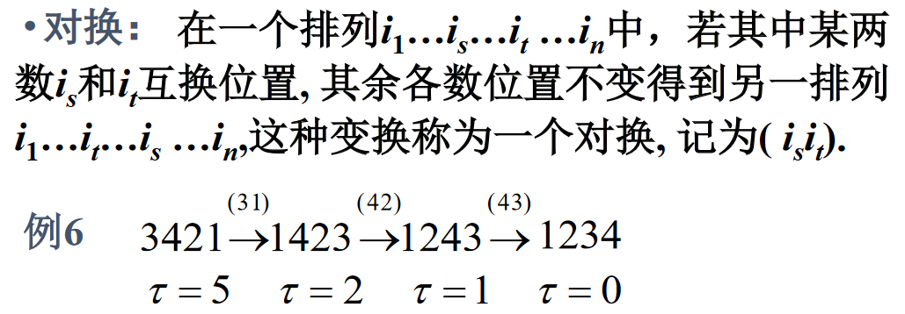
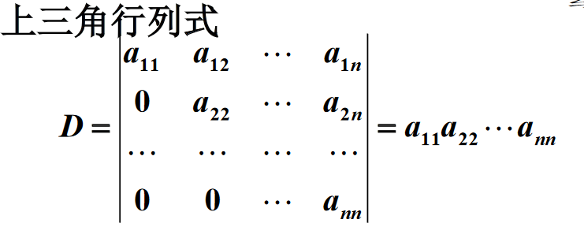

# n级行列式的定义

# 二级行列式

$我们称$

$$
\begin{vmatrix}
a_{11} &a_{12} \\
a_{21} &a_{22} \\
\end{vmatrix}
=a_{11}a_{22}-a_{12}a_{21}
$$

**$为二级行列式.$**

$记$

$$
D_1=
\begin{vmatrix}
b_1 &a_{12} \\
b_2 &a_{22} \\
\end{vmatrix}
,
D_2=
\begin{vmatrix}
a_{11} &b_1 \\
a_{21} &b_2 \\
\end{vmatrix}
$$

$则线性方程组$

$$
\begin{cases}
a_{11}x_1+a_{12}x_2=b_1 \\
a_{21}x_1+a_{22}x_2=b_2 \\
\end{cases}
$$

$的解可表示为$

$$
x_1=\frac{D_1}{D},x_2=\frac{D_2}{D}
$$

# 三级行列式

$$
\begin{vmatrix}
a_{11} &a_{12} &a_{13} \\
a_{21} &a_{22} &a_{23} \\
a_{31} &a_{32} &a_{33} \\
\end{vmatrix}
=a_{11}a_{22}a_{33}+a_{12}a_{23}a_{31}+a_{13}a_{21}a_{32}-a_{13}a_{22}a_{31}-a_{12}a_{21}a_{33}-a_{11}a_{23}a_{32}
$$

$用主对角线法.$

$先写主对角线和副对角线, 然后进行复制,$
$同时将系数的列数加一, 即a_{ij}的j加一, 直到重复为止.$

# 思考

* 各项符号如何定?
  * 逆序数
* 每项是几个元素相乘?
  * n个
* 线性方程组有唯一解的充要条件?
  * D≠0
* 行列式的几何意义?
  * 行列式就是两个列向量组成的平行四边形的面积
* 项数如何确定?
  * n级行列式共有n!个项

# 排列及其逆序数

## 排列

$123 \quad 132 \quad 213 \quad 231 \quad 312 \quad 321 \quad$

上述排列中只有第一个为自然顺序(小→大),

其它则或多或少地破坏了自然顺序(元素大小与位置相反), 构成逆序

## 逆序数

$在一个n 级排列i_1i_2...i_n中，若某两数的前后位置与大小顺序相反,$
$即i_s>i_t(t>s),则称这两数构成一个逆序.$
$排列中逆序的总数,称为它的逆序数，记为\tau(i_1i_2...i_n)$

## 奇偶排列

$奇偶排列:若排列i_1i_2...i_n的逆序数为奇(偶)数，称它为奇(偶)排列.$

$τ(n(n-1)...321)=0+1+2+...+(n-1)=\displaystyle\frac{n(n-1)}{2}$

$τ(135...(2n-1)(2n)(2n-2) ...42)=2+4...+(2n-2)=n(n-1)$

## 对换

### 结论

* 对换改变排列的奇偶性.
* 全部n级排列中,奇偶排列各半(各有$\displaystyle\frac{n!}{2}$).
* 任意一个n级排列与标准排列12...n都可以经过一系列对换互变, 且所作对换的个数与该排列有相同的奇偶性.

### 证明:

结论1:

先证明相邻对换改变奇偶性, 再证明任意对换要进行2n+1次相邻对换.

结论3:

# n级排列式

$$
\begin{aligned}
\begin{vmatrix}
a_{11} &a_{12} &a_{13} \\
a_{21} &a_{22} &a_{23} \\
a_{31} &a_{32} &a_{33} \\
\end{vmatrix}
&=a_{11}a_{22}a_{33}+a_{12}a_{23}a_{31}+a_{13}a_{21}a_{32}-a_{13}a_{22}a_{31}-a_{12}a_{21}a_{33}-a_{11}a_{23}a_{32} \\
&=\sum_{j_1j_2j_3}(-1)^{\tau(j_1j_2j_3)}a_{1j_1}a_{2j_2}a_{3j_3}
\end{aligned}
$$

同理可得n级行列式

$$
\begin{aligned}
D=
\begin{vmatrix}
a_{11} &a_{12} &\cdots &a_{1n} \\
a_{21} &a_{22} &\cdots &a_{2n} \\
\vdots &\vdots &\ddots &\vdots \\
a_{n1} &a_{n2} &\cdots &a_{nn} \\
\end{vmatrix}
&=\sum_{j_1j_2\cdots j_n}(-1)^{\tau(j_1j_2\cdots j_n)}a_{1j_1}a_{2j_2}\cdots a_{nj_n}=\det(a_{ij})
\end{aligned}
$$

$即记为\det(a_{ij})或|A|$

## 上三角行列式

$结论: 上三角行列式的值等于其主对角线上各元素的乘积$
