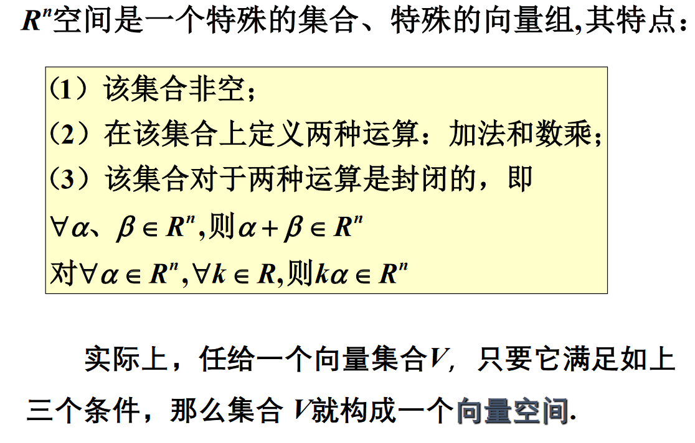

# 向量

$数域P中的n个数组成的有序数组$

$$
(a_1,a_2,\cdots,a_n)或
\begin{pmatrix}
a_1 \\
a_2 \\
\vdots \\
a_n \\
\end{pmatrix}
$$

$称为数域P上的一个n维向量$
$(一般称前者为行向量，称后者为列向量)$
$a_i称为向量的第i个分量$

## 相关概念

## 向量相等

$如果n维度向量对应的分量都相等, 则这两个向量相等.$

## 线性运算

* 加法
* 数乘

# 向量空间

## n维向量空间

$定义了加法与数乘运算的数域P上的所有n维向量构成的集合,$
$称为数域P上的n维向量空间.$

## 定理

$若数量多的向量组可以数量少的向量组表示则前者线性相关$

#### 证明

$\because r>s$

$\therefore\displaystyle\bigcap_{p=1}^s\sum_{i=1}^rt_{pi}k_i=0\rightarrow \exist k_i\neq 0$

$\because\displaystyle \alpha_i=\sum_{j=1}^st_{si}\beta_j$

$
\begin{aligned}
&\sum_{i=1}^rk_i\alpha_i=\sum_{i=1}^rk_i\sum_{j=1}^st_{si}\beta_j=\sum_{i=1}^r\sum_{j=1}^st_{si}k_i\beta_j=\sum_{i=1}^r\sum_{j=1}^st_{si}k_i\beta_j \\
=&\sum_{j=1}^s\sum_{i=1}^rt_{si}k_i\beta_j=\sum_{j=1}^s\beta_j\sum_{i=1}^rt_{si}k_i=0 \\
\Leftrightarrow&\bigcap_{p=1}^n\sum_{j=1}^sb_{jp}\sum_{i=1}^rt_{si}k_i=0 \\
\end{aligned}
$

$由\displaystyle\bigcap_{p=1}^s\sum_{i=1}^rt_{pi}k_i=0\rightarrow \exist k_i\neq 0易知\bigcap_{p=1}^n\sum_{j=1}^sb_{jp}\sum_{i=1}^rt_{si}k_i=0也有非零解$