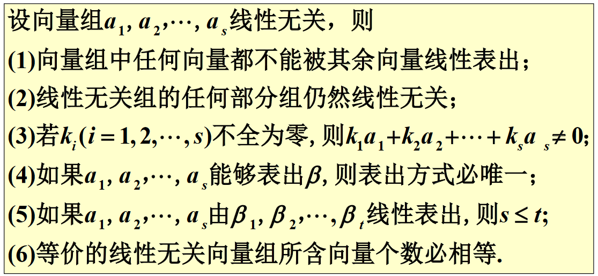

# 向量组的线性相关性

## 线性组合与线性表示

* 零向量是任意向量组的线性组合
* 任一向量可由单位坐标向量组线性表示

## 等价

$若向量组(I)\vec{a_i}每个向量均能用向量组(II)\vec{b_i}的向量线性表示,$
$则称为向量组Ⅰ可用向量组Ⅱ线性表示$

$向量组(I)与向量组(II)可以相互线性表示,则称这两个向量组等价$

## 解方程组

$方程组$

$\Rightarrow$

$向量形式表示方程组$

$\Rightarrow$

$从向量的生成子空间内搜寻可能的表示系数$

$\Rightarrow$

$研究向量空间的结构$

* 一个向量能否用一组向量表示
* 如果能, 表示系数是否唯一
* 如何求表示系数

# 线性相关性

## 定理一

$低维无关,则高维无关;反之,高维相关,则低维相关$

## 定理二

$若向量组α_1,α_2,...,α_r线性无关,而α_1,α_2,...,α_r,β线性相关,$
$则β必可由向量组α_1,α_2,...,α_r线性表示,且表示法唯一.$

## 定理三

$若向量组α_1,α_2,...,α_r(I)可由向量组β_1,β_2,...,β_s(II)线性表示,$
$且r>s,则向量组α1,α2,...,αr必线性相关.$

## 推论一

$若向量组α_1,α_2,...,α_r(I)可由向量组β_1,β_2,...,β_s(II)线性表示,$
$且α_1,α_2,...,α_r线性无关，则必有r≤s.$

## 推论二

$n+1个n维向量必线性相关$

## 推论三

$两个等价的线性无关向量组所含向量个数相同$

# 线性无关向量组的性质

