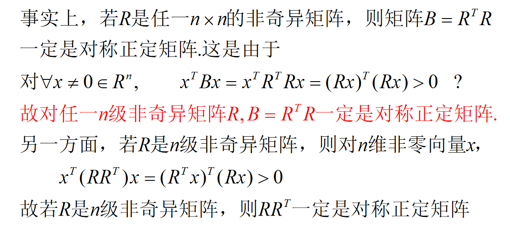

# 正定二次型

## 正定二次型

### 定义

实二次型 $f(x_1,x_2,\cdots,x_n)$ 若对任意一组不全为零的实数 $c_1,c_2,\cdots,c_n$ 都有

$$
f(c_1,c_2,\cdots,c_n)>0
$$

则称 $f$ 为**正定二次型**.

如, $f(x_1,x_2,\cdots,x_n)=\displaystyle\sum_{i=1}^nx_i^2$ 是正定二次型.

但, $f(x_1,x_2,\cdots,x_n)=\displaystyle\sum_{i=1}^{n-1}x_i^2$ 不是正定二次型.

### 判定

1. 实二次型 $\boldsymbol{x}^TA\boldsymbol{x}$ 正定 $\Leftrightarrow$ $\forall \boldsymbol{x}\in\mathbb{R}^n$, 若 $\boldsymbol{x}\neq 0$, 则 $\boldsymbol{x}^TA\boldsymbol{x}>0$
2. 设实二次型 $f(x_1,x_2,\cdots,x_n)=d_1x_1^2+d_2x_2^2+\cdots+d_nx_n^2$, $f$ 正定 $\Leftrightarrow$ $d_i>0,i=1,2,\cdots,n$
3. 非退化线性替换不改变二次型的正定性
4. 设实二次型 $f(x_1,x_2,\cdots,x_n)$, $f$ 正定 $\Leftrightarrow$ $rank(f)=n=p$ ($f$ 的正惯性指数)

其中判定二的充分性显然, 必要性只需带入所有的单位向量即可证.

## 正定矩阵

### 判定

1. 实对称矩阵 $A$ 正定 $\Leftrightarrow$ $A$ 与单位矩阵 $E$ 合同
2. 实对称矩阵 $A$ 正定 $\Leftrightarrow$ 存在可逆矩阵 $C$, 使 $A=C^TC$

### 性质

1. $A^{-1}$ 是正定矩阵
2. $kA,(k>0)$ 是正定矩阵
3. $A$ 的伴随矩阵 $A*$ 是正定矩阵
4. $A^m$ 是正定矩阵 (m 为任意整数)
5. 若 $B$ 也是正定矩阵, 则 $A+B$ 也是正定矩阵

### 必要条件

1. 实对称矩阵 $A=(a_{ij})_{n\times n}$ 正定 $\Rightarrow$ $a_{ii}>0,i=1,2,\cdots,n$
2. 实对称矩阵 $A$ 正定 $\Rightarrow$ $\det A=|A|>0$

### 定理

二次型 $f(x_1,x_2,\cdots,x_n)=x^TAx$ 正定 (或 $A>0$) 的充分必要条件是 $A$ 的各阶顺序主子式都大于零.

证明：

$\Rightarrow$:

分别取 $\boldsymbol{c}=(c_1,c_2,\cdots ,c_k,0,\cdots,0)$, 带入可知 $f(x_1,x_2,\cdots,x_k)$ 也是正定二次型

$\therefore |A_k|>0$

$\Leftrightarrow$:

使用数学归纳法.

$E=G'A_{n-1}G$, 转化为对称矩阵

## 分类

设 $n$ 元二次型 $f(x_1,x_2,\cdots,x_n)=x^TAx$, $A^T=A\in\mathbb{R}^{n\times n}$, 对于任意一组不全为零的实数 $c_1,c_2,\cdots,c_n$, 都有

* $f(c_1,c_2,\cdots,c_n)>0$, 称 $f$ 为**正定二次型**
* $f(c_1,c_2,\cdots,c_n)<0$, 称 $f$ 为**负定二次型**
* $f(c_1,c_2,\cdots,c_n)\geq 0$, 称 $f$ 为**半正定二次型**
* $f(c_1,c_2,\cdots,c_n)\leq 0$, 称 $f$ 为**半负定二次型**
* $f$ 既不是半正定, 也不是半负定, 则称 $f$ 为**不定二次型**

### 判定

* $f(x_1,x_2,\cdots,x_n)$ 正定 $\Leftrightarrow$ $-f(x_1,x_2,\cdots,x_n)$ 负定
  * $A$ 为正定矩阵 $\Leftrightarrow$ $-A$ 为负定矩阵 
* $f(x_1,x_2,\cdots,x_n)$ 半正定 $\Leftrightarrow$ $-f(x_1,x_2,\cdots,x_n)$ 半负定
  * $A$ 为半正定矩阵 $\Leftrightarrow$ $-A$ 为半负定矩阵

### 半正定

