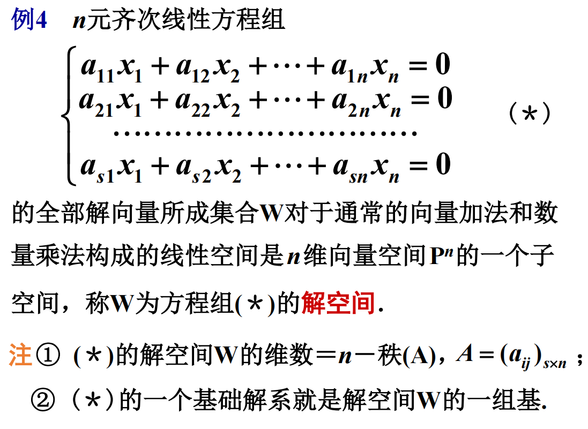

# 线性子空间

## $Ax=b$

* 已知 $A, b$ 求 $x$
* 已知 $x, b$ 求 $A$
* 已知 $A, x$ 求 $b$

1. $b$ 表示为 $a_i$ 的线性组合, $x_i$ 为组合系数;
2. 如果 $A$ 可逆, $a_i=1,\cdots ,n$ 是基, $x_i$ 为这组基下的坐标, $x_i$ 为 $b$ 在以 $A$ 的列为基的坐标;
3. $b$ 在以 $(\xi_1,\xi_2,\cdots,\xi_n)$ 为基下的坐标为 $b$, 则 $A^{-1}b$ 为 $b$ 在以 $A$ 的列为基的坐标, 此时 $A$ 为 $(\xi_1,\xi_2,\cdots,\xi_n)$ 到 $(a_1,a_2,\cdots,a_n)$ 的过渡矩阵(唯一确定);
4. $A^{-1}b$ 为 $b$ 在 $A$ 的列的基上展开式的系数组成的向量.

$\beta_{1}/4+3$

## 线性子空间

### 定义

设 $V$ 是数域 $P$ 上的线性空间, 集合 $W ⊆ V (W≠∅)$, 若 $W$ 对于 $V$ 中的两种运算也构成数域 $P$ 上的线性空间,
则称 $W$ 为 $V$ 的一个**线性子空间**, 简称为**子空间**.

### 第二定义

若满足

1. $V$ 中的零向量在 $W$ 中;
2. $W$ 对向量加法封闭的;
3. $W$ 对标量乘法封闭的.

则称 $W$ 为 $V$ 的一个**线性子空间**, 简称为**子空间**.

### 结论

1. 每个子空间都是一个向量空间;
2. 每个想看空间都是一个子空间, 自身或更大空间的子空间.

### 解空间

## 生成子空间

$V$ 为数域 $P$ 上的线性空间, $\alpha_1,\alpha_2,\cdots,\alpha_r\in V$, 则子空间

$W=\{k_1\alpha_1+k_2\alpha_2+\cdots+k_r\alpha_r|k_i\in P, i=1,2,\cdots ,r\}$

称为 $V$ 的由 $\alpha_1,\alpha_2,\cdots,\alpha_r$ 生成的子空间, 记作 $L(\alpha_1,\alpha_2,\cdots,\alpha_r)$.

称 $\alpha_1,\alpha_2,\cdots,\alpha_r$ 为 $L(\alpha_1,\alpha_2,\cdots,\alpha_r)$ 的一组生成元.
