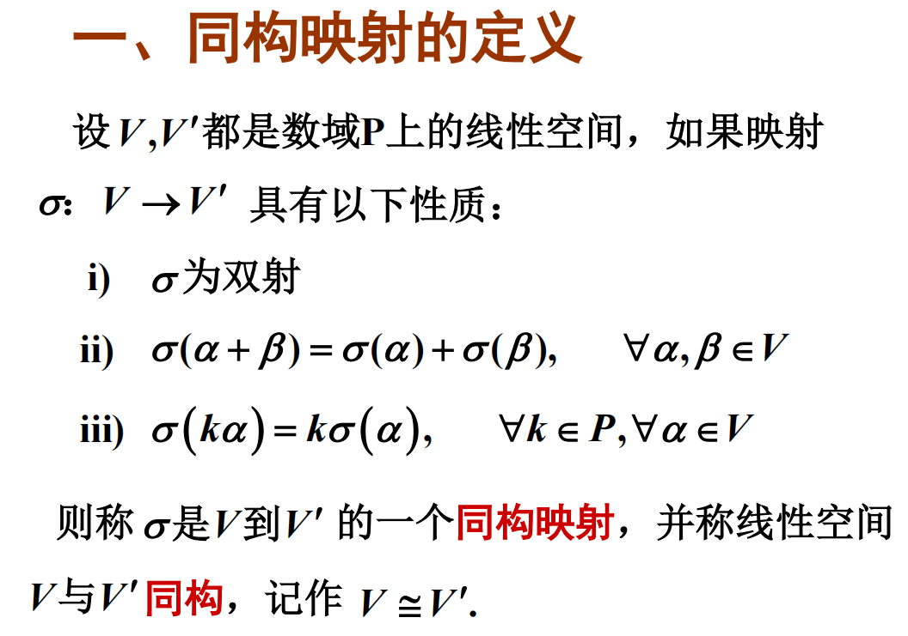
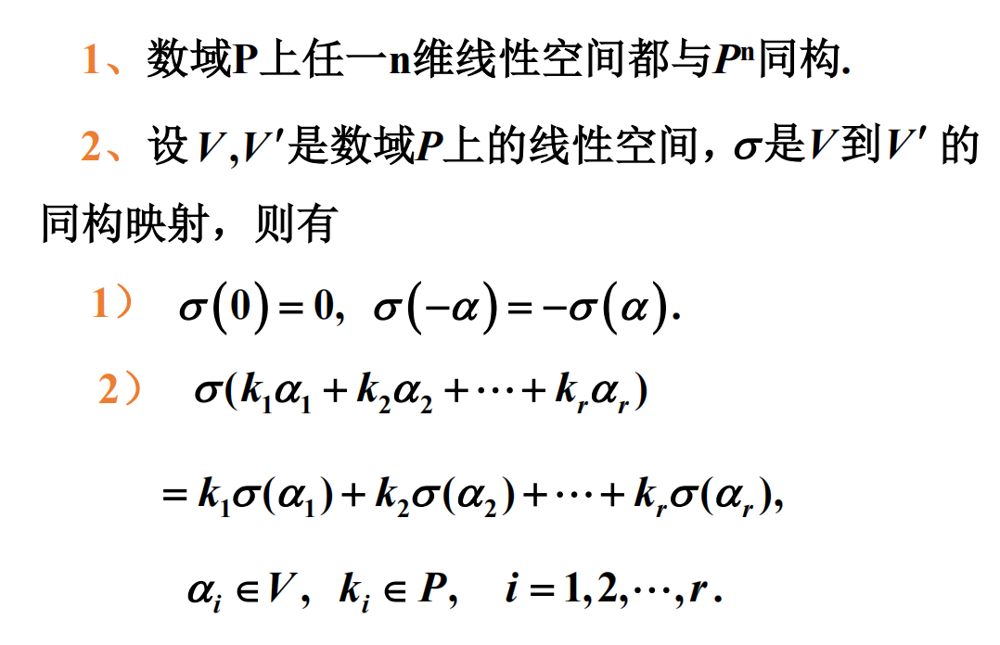
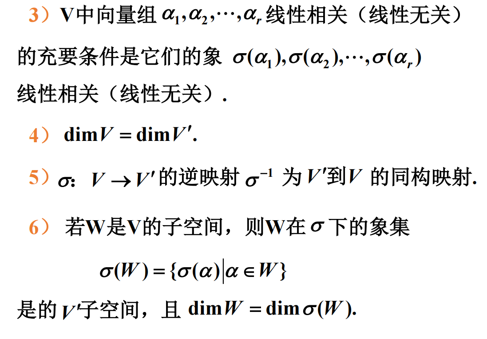
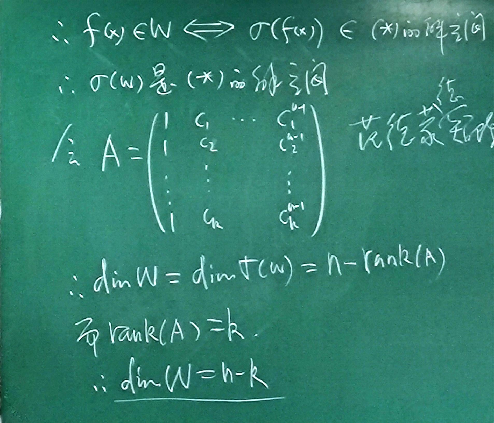

# 同构映射

## 定义

## 思考

1. 任何一个 $n$ 维线性空间 $V$ 都与 $P^n$ 同构? √
2. 恒等映射 $I: V\to V$ 是 $V$ 到 $V$ 自身的同构映射? √

## 结论

## 思考

1. $V$ 中的向量 $\alpha$ 在基 $\alpha_1,\alpha_2,\cdots,\alpha_n$ 下的坐标就是在 $V'$ 中基 $\sigma(\alpha_1),\sigma(\alpha_2),\cdots,\sigma(\alpha_n)$ 下的坐标.
2. 数域 $P$ 上的所有有限维线性空间构成的集合来说:
   1. 维度为 $0$ 的线性空间构成一个同构类? √ $\{0\}$
   2. 维度为 $1$ 的线性空间构成一个同构类? √
   3. $\cdots$ 
   4. 维度为 $n$ 的线性空间构成一个同构类? √
   5. 即维数相同即构成同构类, 线性空间最重要的就是维数.

## 例题

