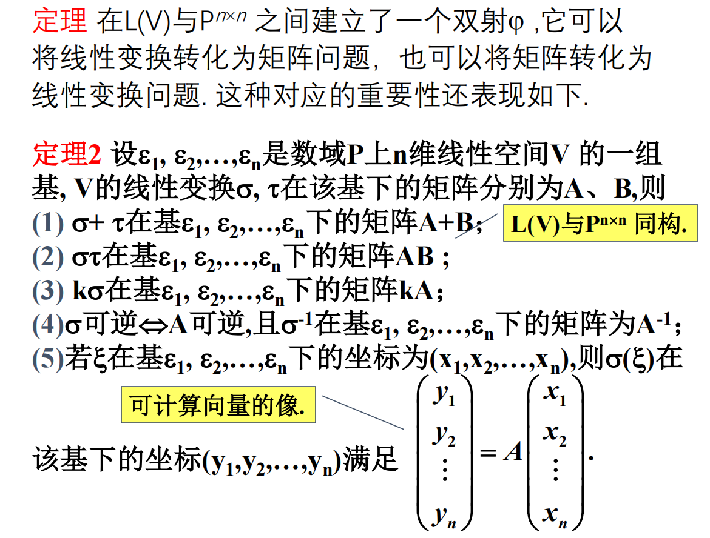
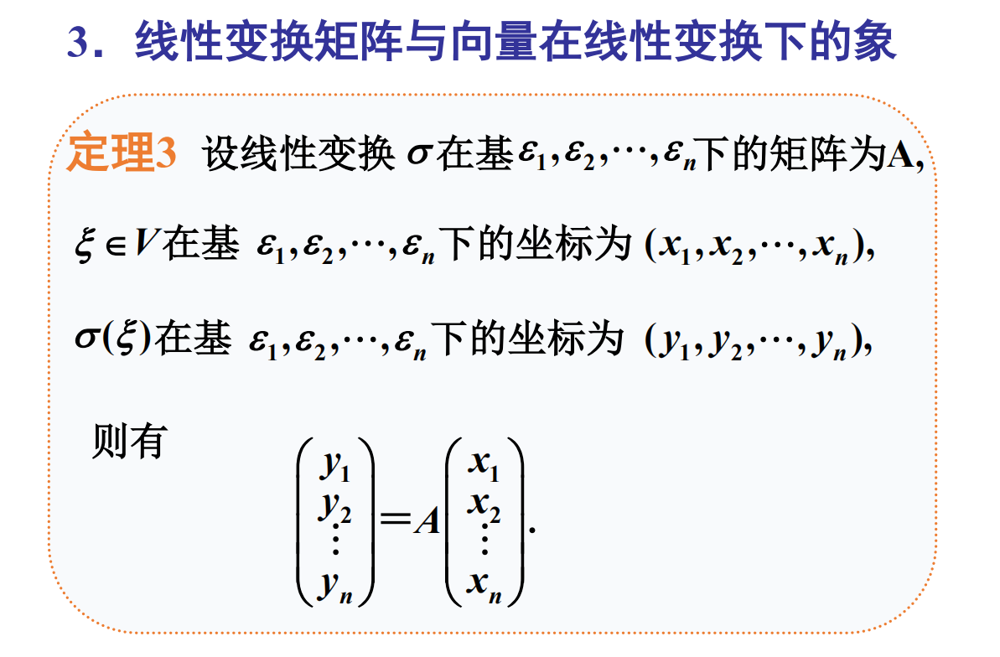
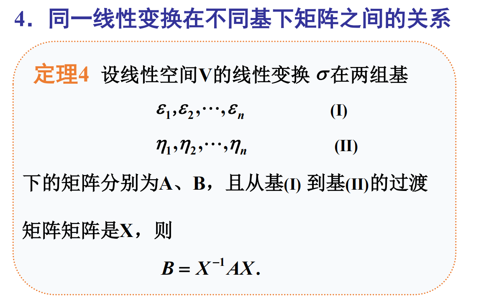
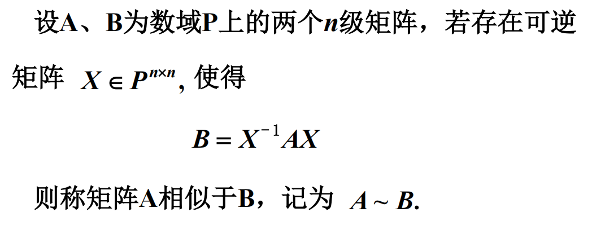

# 线性变换的矩阵

其中 $\sigma((\varepsilon_1,\varepsilon_2,\cdots,\varepsilon_n)B)=\sigma((\varepsilon_1,\varepsilon_2,\cdots,\varepsilon_n))B$ 并不显然.

由

1. $\sigma(\varepsilon_1,\varepsilon_2,\cdots,\varepsilon_n)=(\sigma(\varepsilon_1),\sigma(\varepsilon_2),\cdots,\sigma(\varepsilon_n))$
2. $\sigma(\varepsilon_1+\varepsilon_2)=\sigma(\varepsilon_1)+\sigma(\varepsilon_2)$
3. $\sigma(k\varepsilon)=k\sigma(\varepsilon)$

可得

$
\begin{aligned}
&\quad\ (\sigma\tau)(\varepsilon_1,\varepsilon_2,\cdots,\varepsilon_n) \\
&=\sigma(\tau(\varepsilon_1,\varepsilon_2,\cdots,\varepsilon_n)) \\
&=\sigma((\varepsilon_1,\varepsilon_2,\cdots,\varepsilon_n)B) \\
&=\sigma(b_{11}\varepsilon_1+b_{21}\varepsilon_2+\cdots+b_{n1}\varepsilon_n, \\
&\qquad\ b_{12}\varepsilon_1+b_{22}\varepsilon_2+\cdots+b_{n2}\varepsilon_n, \\
&\qquad\ \cdots \\
&\qquad\ b_{1n}\varepsilon_1+b_{2n}\varepsilon_2+\cdots+b_{nn}\varepsilon_n) \\
&=(\sigma(b_{11}\varepsilon_1+b_{21}\varepsilon_2+\cdots+b_{n1}\varepsilon_n), \cdots, \sigma(b_{1n}\varepsilon_1+b_{2n}\varepsilon_2+\cdots+b_{nn}\varepsilon_n)) \\
&=(b_{11}\sigma(\varepsilon_1)+b_{21}\sigma(\varepsilon_2)+\cdots+b_{n1}\sigma(\varepsilon_n), \\
&\quad\ \ \ b_{12}\sigma(\varepsilon_1)+b_{22}\sigma(\varepsilon_2)+\cdots+b_{n2}\sigma(\varepsilon_n), \\
&\quad\ \ \ \cdots \\
&\quad\ \ \ b_{1n}\sigma(\varepsilon_1)+b_{2n}\sigma(\varepsilon_2)+\cdots+b_{nn}\sigma(\varepsilon_n)) \\
&=(\sigma(\varepsilon_1),\sigma(\varepsilon_2),\cdots,\sigma(\varepsilon_n))B \\
&=\sigma(\varepsilon_1,\varepsilon_2,\cdots,\varepsilon_n)B \\
&=(\varepsilon_1,\varepsilon_2,\cdots,\varepsilon_n)AB \\
\end{aligned}
$

## 相似矩阵

