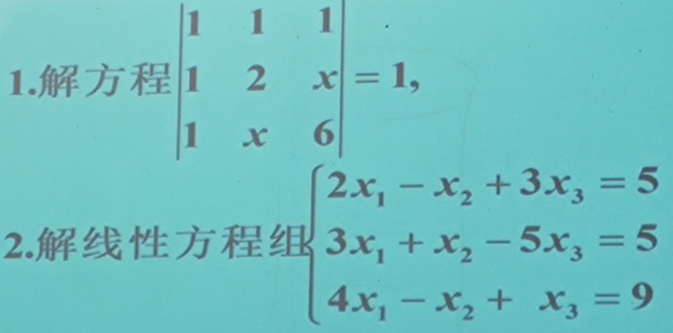

P97: 1(2)

P98: 3.5.6.8.(3).10.13.(2)(4)(5)(6)

# 第一份

## 1.

$解方程$

$$
\begin{vmatrix}
1 &1 &1 \\
1 &2 &x \\
1 &x &6 \\
\end{vmatrix}
=1
$$

$\therefore 12+x+x-2-6-x^2=4+2x-x^2=1$

$\therefore x^2-2x-3=(x-3)(x+1)=0$

$\therefore x=3或x=-1$

## 2.

$\therefore D=2+20-9-12+3-10=-6$

$\quad D_1=5+45-15-27+5-25=-12$

$\quad D_2=10-100+81-60-15+90=6$

$\quad D_3=18-20-15-20+27+10=0$

$\therefore\displaystyle x_1=\frac{D_1}{D}=2,x_2=\frac{D_2}{D}=-1,x_3=\frac{D_3}{D}=0$

# 第二份

## 1.

### (1)

$\therefore \tau(542163)=4+3+1+1=9$

### (2)

$
\begin{aligned}
&\tau(24\cdots(2n-2)(2n)(2n-1)(2n-3)\cdots 31) \\
=& 1+2+\cdots+n+\cdots+2+1 \\
=& n(n+1)-n \\
=& n^2 \\
\end{aligned}
$

## 2.

$①当n=2时,$

$\because \tau(x_1x_2)=I'$

$\therefore \tau(x_2x_1)=1-I'=\displaystyle\frac{n(n-1)}{2}-I' 成立$

$②假设n=k时, \tau(x_1x_2\cdots x_k)=I'$

$\therefore \tau(x_kx_{k-1}\cdots x_1)=\displaystyle\frac{k(k-1)}{2}-I'成立$

$当n=k+1时, \tau(x_1x_2\cdots x_kx_{k+1})=I=I'+I-I'$

$\therefore \tau(x_kx_{k-1}\cdots x_1x_{k+1})=\displaystyle\frac{k(k-1)}{2}-I'+I-I'=\frac{k(k-1)}{2}+I-2I'$

$\because 对于x_{k+1}来看, x_kx_{k-1}\cdots x_1中有I-I'个数大于x_{k+1}$

$\therefore x_{k+1}大于k-(I-I')=k-I+I'个数$

$\therefore \tau(x_{k+1}x_k\cdots x_1)=\displaystyle(\frac{k(k-1)}{2}+I-2I')-(I-I')+(k-I+I')$

$\therefore \tau(x_{k+1}x_k\cdots x_1)=\displaystyle\frac{k(k+1)}{2}-I$

$\therefore 综上, \tau(x_nx_{n-1}\cdots x_1)=\displaystyle\frac{n(n-1)}{2}-I成立$

# 第三份

## 1.

$\therefore D=(-1)^{\tau(23\cdots (n-1)n1)}1\times 2\times\cdots\times n=(-1)^{n-1}n!$

## 2.

$$
\begin{vmatrix}
a_{11} &a_{12} &a_{13} &a_{14} \\
a_{21} &a_{22} &a_{23} &a_{24} \\
a_{31} &a_{32} &a_{33} &a_{34} \\
a_{41} &a_{42} &a_{43} &a_{44} \\
\end{vmatrix}
$$

$\therefore 行列式中有a_{23}a_{41}的项是(-1)^{\tau(2341)}a_{12}a_{23}a_{34}a_{41}和(-1)^{\tau(4321)}a_{14}a_{23}a_{32}a_{41}$

$\therefore 易知-a_{12}a_{23}a_{34}a_{41}符合要求$

# 书上习题

## 1(2)

$\therefore \tau(217986354)=18, 奇偶性为偶$

##