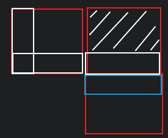

P109~203:

1.(2) 2(3,5,6) 4.(1,2) 5. 7.(3) 10. 12. 14. 15. 16. 17. 18. 20(3,7,10) 21. 22. 23.(2,4) 24.(1) 25. 28. 29. 30.

# 1. (2)

$$
\begin{aligned}
AB
=\begin{pmatrix}a&b&c\\c&b&a\\1&1&1\end{pmatrix}\begin{pmatrix}1&a&c\\1&b&b\\1&c&a\end{pmatrix}=
\begin{pmatrix}
a+b+c&a^2+b^2+c^2&2ac+b^2\\
c+b+a&2ac+b^2&a^2+b^2+c^2\\
3&a+b+c&a+b+c\end{pmatrix} \\
\end{aligned}
$$

$$
\begin{aligned}
AB-BA
&=\begin{pmatrix}a&b&c\\c&b&a\\1&1&1\end{pmatrix}\begin{pmatrix}1&a&c\\1&b&b\\1&c&a\end{pmatrix}-\begin{pmatrix}1&a&c\\1&b&b\\1&c&a\end{pmatrix}\begin{pmatrix}a&b&c\\c&b&a\\1&1&1\end{pmatrix} \\
&=
\begin{pmatrix}
a+b+c&a^2+b^2+c^2&2ac+b^2\\
c+b+a&2ac+b^2&a^2+b^2+c^2\\
3&a+b+c&a+b+c
\end{pmatrix}\\
&-
\begin{pmatrix}
a+ac+c&b+ab+c&2c+a^2\\
a+bc+b&2b+b^2&c+ab+b\\
2a+c^2&b+bc+a&c+ac+a
\end{pmatrix}\\
&=
\begin{pmatrix}
ac-b&b+ab+c-a^2-b^2-c^2&2c+a^2-b^2-2ac\\
bc-c&2b-2ac&c+ab+b-a^2-b^2-c^2\\
2a+c^2-3&bc-c&ac-b
\end{pmatrix}\\
\end{aligned}
$$

# 2.

## (3)

$当n=1时, \begin{pmatrix}1&1\\0&1\end{pmatrix}^1=\begin{pmatrix}1&1\\0&1\end{pmatrix}$

$当n=k时, 假设\begin{pmatrix}1&1\\0&1\end{pmatrix}^k=\begin{pmatrix}1&k\\0&1\end{pmatrix}$

$\therefore\begin{pmatrix}1&1\\0&1\end{pmatrix}^{k+1}=\begin{pmatrix}1&1\\0&1\end{pmatrix}^k\begin{pmatrix}1&1\\0&1\end{pmatrix}=\begin{pmatrix}1&k\\0&1\end{pmatrix}\begin{pmatrix}1&1\\0&1\end{pmatrix}=\begin{pmatrix}1&1k+1\\0&1\end{pmatrix}$

$\therefore 综上\begin{pmatrix}1&1\\0&1\end{pmatrix}^n=\begin{pmatrix}1&n\\0&1\end{pmatrix}$

## (5)

$\begin{pmatrix}2&3&-1\end{pmatrix}\begin{pmatrix}1\\-1\\-1\end{pmatrix}=2-3+1=0$

$\begin{pmatrix}1\\-1\\-1\end{pmatrix}\begin{pmatrix}2&3&-1\end{pmatrix}=\begin{pmatrix}2&3&-1\\-2&-3&1\\-2&-3&1\end{pmatrix}$

## (6)

$$
\begin{aligned}
&\begin{pmatrix}x&y&1\end{pmatrix}
\begin{pmatrix}a_{11}&a_{12}&b_1\\a_{12}&a_{22}&b_2\\b_1&b_2&c\end{pmatrix}\begin{pmatrix}x\\y\\1\end{pmatrix}\\ =
&\begin{pmatrix}a_{11}x+a_{12}x+b_1x&a_{12}x+a_{22}x+b_2x&b_1x+b_2y+c\end{pmatrix}\begin{pmatrix}x\\y\\1\end{pmatrix} \\ =
&a_{11}x^2+a_{12}x^2+b_1x^2+a_{12}xy+a_{22}xy+b_2xy+b_1x+b_2y+c \\
\end{aligned}
$$

# 4.

## (1)

$AB=\begin{pmatrix}1&1\\0&1\end{pmatrix}\begin{pmatrix}x_1&x_2\\x_3&x_4\end{pmatrix}=\begin{pmatrix}x_1+x_3&x_2+x_4\\x_3&x_4\end{pmatrix}$

$BA=\begin{pmatrix}x_1&x_2\\x_3&x_4\end{pmatrix}\begin{pmatrix}1&1\\0&1\end{pmatrix}=\begin{pmatrix}x_1&x_1+x_2\\x_3&x_3+x_4\end{pmatrix}$

$
\therefore
\begin{cases}
x_1=x_1+x_3 \\
x_2+x_4=x_1+x_2 \\
x_3=x_3 \\
x_4=x_3+x_4 \\
\end{cases}
\Rightarrow
\begin{cases}
x_3=0 \\
x_4=x_1 \\
\end{cases}
$

$\therefore 取x_1和x_2为自由变量$

$\therefore 与A可交换的矩阵B=\begin{pmatrix}x_1&x_2\\0&x_1\end{pmatrix}$

## (2)

$AB=\begin{pmatrix}1&0&0\\0&1&2\\3&1&2\end{pmatrix}\begin{pmatrix}x_1&x_2&x_3\\x_4&x_5&x_6\\x_7&x_8&x_9\end{pmatrix}=\begin{pmatrix}x_1&x_2&x_3\\x_4+2x_7&x_5+2x_8&x_6+2x_9\\3x_1+x_4+2x_7&3x_2+x_5+2x_8&3x_3+x_6+2x_9\end{pmatrix}$

$BA=\begin{pmatrix}x_1&x_2&x_3\\x_4&x_5&x_6\\x_7&x_8&x_9\end{pmatrix}\begin{pmatrix}1&0&0\\0&1&2\\3&1&2\end{pmatrix}=\begin{pmatrix}x_1+3x_3&x_2+x_3&2x_2+2x_3\\x_4+3x_6&x_5+x_6&2x_5+2x_6\\x_7+3x_9&x_8+x_9&2x_8+2x_9\end{pmatrix}$

$$
\begin{cases}
x_1=x_1+3x_3 \\
x_2=x_2+x_3 \\
x_3=2x_2+2x_3 \\
x_4+2x_7=x_4+3x_6 \\
x_5+2x_8=x_5+x_6 \\
x_6+2x_9=2x_5+2x_6 \\
3x_1+x_4+2x_7=x_7+3x_9 \\
3x_2+x_5+2x_8=x_8+x_9 \\
3x_3+x_6+2x_9=2x_8+2x_9 \\
\end{cases}
\Rightarrow
\begin{cases}
x_2=0 \\
x_3=0 \\
x_5=x_1+\frac{1}{3}x_4 \\
x_6=\frac{2}{3}x_7 \\
x_8=\frac{1}{3}x_7 \\
x_9=x_5+\frac{1}{3}x_7 \\
\end{cases}
$$

$取x_1,x_4,x_7为自由变量, 则B=\begin{pmatrix}x_1&0&0\\x_4&x_1+\frac{1}{3}x_4&\frac{2}{3}x_7\\x_7&\frac{1}{3}x_7&x_1+\frac{1}{3}x_4+\frac{1}{3}x_7\end{pmatrix}$

# 5.

$AB=\begin{pmatrix}a_1&0&\cdots &0\\0&a_2&\cdots &0\\\vdots &\vdots & &\vdots \\0&0&\cdots &a_n\end{pmatrix}\begin{pmatrix}x_{11}&x_{12}&\cdots &x_{1n}\\x_{21}&x_{22}&\cdots &x_{2n}\\\vdots &\vdots & &\vdots \\x_{n1}&x_{n2}&\cdots &x_{nn}\\\end{pmatrix}=\begin{pmatrix}a_1x_{11}&a_1x_{12}&\cdots &a_1x_{1n}\\a_2x_{21}&a_2x_{22}&\cdots &a_2x_{2n}\\\vdots &\vdots & &\vdots \\a_nx_{n1}&a_nx_{n2}&\cdots &a_nx_{nn}\\\end{pmatrix}$

$BA=\begin{pmatrix}x_{11}&x_{12}&\cdots &x_{1n}\\x_{21}&x_{22}&\cdots &x_{2n}\\\vdots &\vdots & &\vdots \\x_{n1}&x_{n2}&\cdots &x_{nn}\\\end{pmatrix}\begin{pmatrix}a_1&0&\cdots &0\\0&a_2&\cdots &0\\\vdots &\vdots & &\vdots \\0&0&\cdots &a_n\end{pmatrix}=\begin{pmatrix}a_1x_{11}&a_2x_{12}&\cdots &a_nx_{1n}\\a_1x_{21}&a_2x_{22}&\cdots &a_nx_{2n}\\\vdots &\vdots & &\vdots \\a_1x_{n1}&a_2x_{n2}&\cdots &a_nx_{nn}\\\end{pmatrix}$

$\because a_{i}\neq a_{j}, i\neq j$

$\therefore a_{i}x_{pq}\neq a_{j}x_{pq}, i\neq j$

$\therefore x_{ij}=0, i\neq j$

$\therefore 与A可交换的矩阵只能是对角矩阵$

# 7. (3)

$设B是任一个n级矩阵, B=\begin{pmatrix}b_{11}&b_{12}&\cdots &b_{1n}\\b_{21}&b_{22}&\cdots &b_{2n}\\\vdots &\vdots & &\vdots \\b_{n1}&b_{n2}&\cdots &b_{nn}\end{pmatrix}$

$由第5.题可知, A一定是一个对角矩阵, 设为A=\begin{pmatrix}a_1&0&\cdots &0\\0&a_2&\cdots &0\\\vdots &\vdots & &\vdots \\0&0&\cdots &a_n\end{pmatrix}$

$\therefore AB=\begin{pmatrix}a_1b_{11}&a_1b_{12}&\cdots &a_1b_{1n}\\a_2b_{21}&a_2b_{22}&\cdots &a_2b_{2n}\\\vdots &\vdots & &\vdots \\a_nb_{n1}&a_nb_{n2}&\cdots &a_nb_{nn}\end{pmatrix}$

$\quad BA=\begin{pmatrix}a_1b_{11}&a_2b_{12}&\cdots &a_nb_{1n}\\a_1b_{21}&a_2b_{22}&\cdots &a_nb_{2n}\\\vdots &\vdots & &\vdots \\a_1b_{n1}&a_2b_{n2}&\cdots &a_nb_{nn}\end{pmatrix}$

$\because AB=BA$

$\therefore a_ib_{ij}=a_jb_{ij}$

$\therefore a_i=a_j=a$

$\therefore A是一个数量矩阵, A=aE$

# 10.

$\therefore A=\begin{pmatrix}a_{11}&a_{12}&\cdots &a_{1n}\\a_{12}&a_{22}&\cdots &a_{2n}\\\vdots &\vdots & &\vdots \\a_{1n}&a_{2n}&\cdots &a_{nn}\end{pmatrix}$

$\therefore A^2=\begin{pmatrix}\displaystyle\sum a_{1j}^2&\cdots &\cdots &\cdots \\\cdots &\displaystyle\sum a_{2j}^2&\cdots &\cdots \\\vdots &\vdots & &\vdots \\\cdots &\cdots &\cdots &\displaystyle\sum a_{nj}^2\end{pmatrix}$

$\because A^2=O$

$\therefore \displaystyle\sum a_{1j}^2=0, \displaystyle\sum a_{2j}^2=0,\cdots ,\displaystyle\sum a_{nj}^2=0$

$\therefore a_{ij}^2=0$

$\therefore a_{ij}=0$

$\therefore A=O$

# 12.

$设A是任意一个n\times n矩阵$

$\displaystyle 令B=\frac{1}{2}(A+A^T), C=\frac{1}{2}(A-A^T)$

$易知A=B+C=\displaystyle\frac{1}{2}(A+A^T)+\frac{1}{2}(A-A^T)$

$\because B^T=\displaystyle[\frac{1}{2}(A+A^T)]^T=\frac{1}{2}(A+A^T)^T=\frac{1}{2}(A+A^T)=B$

$\therefore B是对称矩阵$

$\displaystyle\because C^T=[\frac{1}{2}(A-A^T)]^T=\frac{1}{2}(A^T-A)=-\frac{1}{2}(A-A^T)=-C$

$\therefore C是反称矩阵$

$\therefore 原命题得证$

# 14.

$对于必要性:$

$\because |A|=0$

$\therefore A必有两个或以上的列向量线性相关$

$\therefore A可以写成\begin{pmatrix}0&a_{12}&\cdots &a_{1n}\\0&a_{22}&\cdots &a_{2n}\\\vdots &\vdots & &\vdots \\0&a_{n2}&\cdots &a_{nn}\end{pmatrix}$

$\because 令B=\begin{pmatrix}1&0&\cdots &0\\0&0&\cdots &0\\\vdots &\vdots & &\vdots \\0&0&\cdots &0\end{pmatrix}$

$\therefore AB=O, 存在一个非零矩阵B成立$

$对于充分性:$

$假设|A|\neq 0, 则A可逆, 设A的逆矩阵为A^{-1}$

$\because AB=O$

$\therefore B=A^{-1}AB=A^{-1}O=O, 与B为非零矩阵矛盾$

$\therefore |A|=0$

$原命题得证$

# 15.

$设A=\begin{pmatrix}a_{11}&a_{12}&\cdots &a_{1n}\\a_{21}&a_{22}&\cdots &a_{2n}\\\vdots &\vdots & &\vdots \\a_{n1}&a_{n2}&\cdots &a_{nn}\end{pmatrix}$

$\therefore AX=\begin{pmatrix}a_{11}&a_{12}&\cdots &a_{1n}\\a_{21}&a_{22}&\cdots &a_{2n}\\\vdots &\vdots & &\vdots \\a_{n1}&a_{n2}&\cdots &a_{nn}\end{pmatrix}\begin{pmatrix}x_1\\x_2\\\vdots\\x_n\end{pmatrix}=\begin{pmatrix}\sum a_{1i}x_i\\\sum a_{2i}x_i\\\vdots\\\sum a_{ni}x_i\end{pmatrix}=\begin{pmatrix}0\\0\\\vdots\\0\end{pmatrix}$

$不妨假设a_{11}\neq 0$

$当x_i=1时, 则a_{11}x_1=a_{11}=-\displaystyle\sum_{i=2}^na_{1i}\neq 0$

$再取x_1=-1, x_i=1, i=1,2,\cdots ,n$
$此时\displaystyle\sum_{i=1}^na_{1i}x_i=-a_{11}+\sum_{i=2}^na_{1i}=-2a_{11}\neq 0, 产生矛盾$

$因此a_{11}=0$

$同理可知a_{ij}=0$

$\therefore A=O$

# 16.

## (1)

$\because rank(C)=r$

$\therefore r\leq n$

$\therefore 可知C可以改写成\begin{pmatrix}c_{11}&c_{12}&\cdots &c_{1r} &0 &\cdots &0\\c_{21}&c_{22}&\cdots &c_{2r} &0 &\cdots &0\\\vdots &\vdots & &\vdots &\vdots & &\vdots \\c_{r1}&c_{r2}&\cdots &c_{rr} &0 &\cdots &0\end{pmatrix}$
$\quad 即记为(D\quad0\quad\cdots\quad0), 其中D为r\times r矩阵$

$\therefore BC=B(D\quad0\quad\cdots\quad0)=(BD\quad0\quad\cdots\quad0)$

$其中BD为r\times r矩阵相乘$

$\because rank(C)=r$

$\therefore rank(D)=r, 即|D|\neq 0, D存在逆矩阵, 记为D^{-1}$

$\because BC=O$

$\therefore BD=O$

$\therefore B=BDD^{-1}=OD^{-1}=O$

## (2)

$同理可设C=(D\quad0\quad\cdots\quad0)$

$\because BC=C$

$\therefore BD=D$

$\therefore B=BDD^{-1}=DD^{-1}=E$

# 17.

$设A=\begin{pmatrix}\vec a_1\\\vec a_2\\\vdots \\\vec a_n\end{pmatrix}, B=\begin{pmatrix}\vec b_1\\\vec b_2\\\vdots \\\vec b_n\end{pmatrix}$

$设向量组V=\{\vec a_1, \vec a_2, \cdots, \vec a_n, \vec b_1, \vec b_2, \cdots, \vec b_n\}$

$易知向量组V的秩小于等于rank(A)+rank(B)$

$\because A+B=\begin{pmatrix}\vec a_1+\vec b_1\\\vec a_2+\vec b_2\\\vdots \\\vec a_n+\vec b_n\end{pmatrix},$
$\quad 即A+B中每个向量都能由V中的向量线性表示$

$\therefore rank(A+B)\leq rank(V)\leq rank(A)+rank(B)$

$\therefore rank(A+B)\leq rank(A)+rank(B)$

# 18.

$\because AB=O$

$\therefore |AB|=|A||B|=|O|=0$

$\therefore A和B中必定有一个行列式为0, 不妨设|A|=0, rank(A)=r$

$\therefore A可以表示成A=\begin{pmatrix}0 &\cdots &0&a_{11}&a_{12}&\cdots &a_{1r}\\0 &\cdots &0&a_{21}&a_{22}&\cdots &a_{2r}\\\vdots & &\vdots &\vdots &\vdots & &\vdots \\0 &\cdots &0&a_{r1}&a_{r2}&\cdots &a_{rr}\\0 &\cdots &0&0&0&\cdots &0\\\vdots & &\vdots &\vdots &\vdots & &\vdots \\0 &\cdots &0&0&0&\cdots &0\end{pmatrix}$
$\quad简写为A=\begin{pmatrix}0&A_r\\0&0\end{pmatrix}$

$\quad B可以写为B=\begin{pmatrix}b_{11}&b_{12}&\cdots &b_{1n}\\b_{21}&b_{22}&\cdots &b_{2n}\\\vdots &\vdots & &\vdots \\b_{(n-r)1}&b_{(n-r)2}&\cdots &b_{(n-r)n}\\c_{11}&c_{12}&\cdots &c_{1n}\\\vdots &\vdots & &\vdots\\c_{r1}&c_{r2}&\cdots &c_{rn}\end{pmatrix}$
$\quad 简写为B=\begin{pmatrix}B_r\\C\end{pmatrix}$

$其中B的前n-r个行向量都确保尽量线性无关$

$\therefore AB=\begin{pmatrix}A_rC\\0\end{pmatrix}=\begin{pmatrix}0\\0\end{pmatrix}$

$\therefore 可知A_rC=O, 且|A_r|\neq 0, 存在逆矩阵A_r^T$

$\therefore C=A_r^TA_rC=A_r^TO=O$

$\therefore rank(B)\leq n-r$

$\therefore rank(A)+rank(B)\leq r+n-r=n$

# 20.

## (3)

$\therefore A^*=\begin{pmatrix}-1&4&3\\-1&5&3\\1&-6&-4\end{pmatrix}, |A|=-2+6-3-2=-1$

$\therefore A^{-1}=\begin{pmatrix}1&-4&-3\\1&-5&-3\\-1&6&4\end{pmatrix}$

## (7)

$\therefore A^*=\begin{pmatrix}1&-3&11&-38\\0&1&-2&7\\0&0&1&-2\\0&0&0&1\end{pmatrix}, |A|=1$

$\therefore A^{-1}=\begin{pmatrix}1&-3&11&-38\\0&1&-2&7\\0&0&1&-2\\0&0&0&1\end{pmatrix}$

## (10)

$\therefore A^*=\begin{pmatrix}16&-8&4&-2&1\\0&16&-8&4&-2\\0&0&16&-8&4\\0&0&0&16&-8\\0&0&0&0&16\end{pmatrix}, |A|=32$

$\therefore A^{-1}=\begin{pmatrix}\frac{1}{2}&\frac{1}{4}&\frac{1}{8}&\frac{1}{16}&\frac{1}{32}\\0&\frac{1}{2}&\frac{1}{4}&\frac{1}{8}&\frac{1}{16}\\0&0&\frac{1}{2}&\frac{1}{4}&\frac{1}{8}\\0&0&0&\frac{1}{2}&\frac{1}{4}\\0&0&0&0&\frac{1}{2}\end{pmatrix}$

# 21.

$\because\begin{pmatrix}O&A\\C&O\end{pmatrix}\begin{pmatrix}O&C^{-1}\\A^{-1}&O\end{pmatrix}=\begin{pmatrix}AA^{-1}&O\\O&CC^{-1}\end{pmatrix}=E$

$\therefore X^{-1}=\begin{pmatrix}O&C^{-1}\\A^{-1}&O\end{pmatrix}$

# 22.

$\because \begin{pmatrix}0&a_1&0&\cdots &0&0\\0&0&a_2&\cdots &0&0\\\vdots &\vdots &\vdots & &\vdots&\vdots \\0&0&0&\cdots &0&a_{n-1}\\a_n&0&0&\cdots &0&0\\\end{pmatrix}\begin{pmatrix}0&0&0&\cdots &0&\frac{1}{a_n}\\\frac{1}{a_1}&0&0&\cdots &0&0\\0&\frac{1}{a_2}&0&\cdots &0&0\\\vdots &\vdots &\vdots & &\vdots&\vdots \\0&0&0&\cdots &0&0\\0&0&0&\cdots &\frac{1}{a_{n-1}}&0\\\end{pmatrix}=E$

$\therefore X^{-1}=\begin{pmatrix}0&0&0&\cdots &0&\frac{1}{a_n}\\\frac{1}{a_1}&0&0&\cdots &0&0\\0&\frac{1}{a_2}&0&\cdots &0&0\\\vdots &\vdots &\vdots & &\vdots&\vdots \\0&0&0&\cdots &0&0\\0&0&0&\cdots &\frac{1}{a_{n-1}}&0\\\end{pmatrix}$

# 23.

## (2)

$设A=\begin{pmatrix}1&1&-1\\0&2&2\\1&-1&0\end{pmatrix}$

$\therefore A^*=\begin{pmatrix}2&1&4\\2&1&-2\\-2&2&2\end{pmatrix}, |A|=6$

$\therefore A^{-1}=\begin{pmatrix}\frac{1}{3}&\frac{1}{6}&\frac{2}{3}\\\frac{1}{3}&\frac{1}{6}&-\frac{1}{3}\\-\frac{1}{3}&\frac{1}{3}&\frac{1}{3}\end{pmatrix}$

$\therefore X=\begin{pmatrix}\frac{1}{3}&\frac{1}{6}&\frac{2}{3}\\\frac{1}{3}&\frac{1}{6}&-\frac{1}{3}\\-\frac{1}{3}&\frac{1}{3}&\frac{1}{3}\end{pmatrix}\begin{pmatrix}1&-1&1\\1&1&0\\2&1&1\end{pmatrix}=\begin{pmatrix}\frac{11}{6}&\frac{1}{2}&1\\-\frac{1}{6}&-\frac{1}{2}&0\\\frac{2}{3}&1&0\end{pmatrix}$

## (4)

$令A=\begin{pmatrix}1&1&-1\\0&2&2\\1&-1&0\end{pmatrix}$

$\therefore A^*=\begin{pmatrix}2&1&4\\2&1&-2\\-2&2&2\end{pmatrix}, |A|=6$

$\therefore A^{-1}=\begin{pmatrix}\frac{1}{3}&\frac{1}{6}&\frac{2}{3}\\\frac{1}{3}&\frac{1}{6}&-\frac{1}{3}\\-\frac{1}{3}&\frac{1}{3}&\frac{1}{3}\end{pmatrix}$

$\therefore X=\begin{pmatrix}1&-1&1\\1&1&0\\2&1&1\end{pmatrix}\begin{pmatrix}\frac{1}{3}&\frac{1}{6}&\frac{2}{3}\\\frac{1}{3}&\frac{1}{6}&-\frac{1}{3}\\-\frac{1}{3}&\frac{1}{3}&\frac{1}{3}\end{pmatrix}=\begin{pmatrix}-\frac{1}{3}&\frac{1}{3}&\frac{4}{3}\\\frac{2}{3}&\frac{1}{3}&\frac{1}{3}\\\frac{2}{3}&\frac{5}{6}&\frac{4}{3}\end{pmatrix}$

# 24. (1)

$假设A为对称矩阵, 则A=A^T$

$\therefore A^{-1}=(A^T)^{-1}=(A^{-1})^T$

$即A^{-1}也为对称矩阵$

$假设A为反称矩阵, 则A=-A^T$

$\therefore A^{-1}=(-A^T)^{-1}=-(A^T)^{-1}=-(A^{-1})^T=(-A^{-1})^T$

$即A^{-1}也为对称矩阵$

# 25.

## (1)

$设A=\begin{pmatrix}a_{11}&a_{12}&\cdots &a_{1n}\\0&a_{22}&\cdots &a_{2n}\\\vdots &\vdots & &\vdots \\0&0&\cdots &a_{nn}\end{pmatrix}, B=\begin{pmatrix}b_{11}&b_{12}&\cdots &b_{1n}\\0&b_{22}&\cdots &b_{2n}\\\vdots &\vdots & &\vdots \\0&0&\cdots &b_{nn}\end{pmatrix}$

$令C=AB, 则有$

$当i\leq j时,$

$c_{ij}=\displaystyle\sum_{k=1}^na_{ik}b_{kj}=\sum_{k=i}^na_{ik}b_{kj}不一定等于0$

$当i>j时,$

$c_{ij}=\displaystyle\sum_{k=1}^na_{ik}b_{kj}$

$当1\leq k<i, a_{ik}=0, 当j<k\leq n, b_{kj}=0$

$\therefore c_{ij}=0$

$\therefore 两个三角形矩阵的乘积仍是三角形矩阵$

## (2)

$设A^*=(A_{ji})$

$当j=1或i=1且i\neq j时, 易知A_{ji}=0$

$当i>j且i\geq 2且j\geq 2时$

$A_{ji}=a_{11}\cdots \times0\times\cdots a_{nn}=0$

$\therefore 可逆的三角矩阵的逆依然是三角矩阵$

# 28. (1)

$A^*=\begin{pmatrix}4&4&4&4\\4&-4&4&-4\\4&4&-4&-4\\4&-4&-4&4\end{pmatrix}, |A|=16$

$\therefore A^{-1}=\begin{pmatrix}\frac{1}{4}&\frac{1}{4}&\frac{1}{4}&\frac{1}{4}\\\frac{1}{4}&-\frac{1}{4}&\frac{1}{4}&-\frac{1}{4}\\\frac{1}{4}&\frac{1}{4}&-\frac{1}{4}&-\frac{1}{4}\\\frac{1}{4}&-\frac{1}{4}&-\frac{1}{4}&\frac{1}{4}\end{pmatrix}$