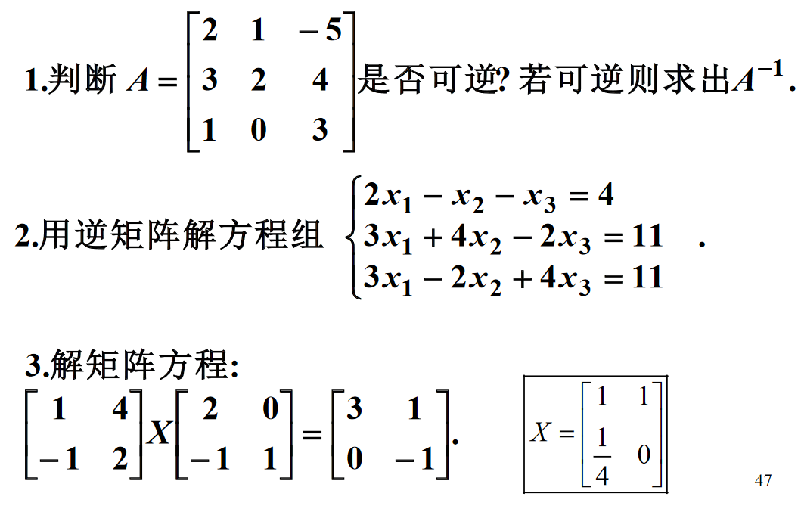

21. 28. 29. 30. 

# 1.

$\because A=\begin{bmatrix}2&1&-5\\3&2&4\\1&0&3\end{bmatrix}$

$\therefore |A|=17, 矩阵A可逆$

$$
\begin{aligned}
\because [A \quad E]
&\rightarrow
\begin{bmatrix}
2 &1 &-5 &1 &0 &0 \\
3 &2 &4 &0 &1 &0 \\
1 &0 &3 &0 &0 &1 \\
\end{bmatrix}
\rightarrow
\begin{bmatrix}
1 &0 &3   &0 &0 &1 \\
0 &1 &-11 &1 &0 &-2 \\
0 &0 &17  &-2 &1 &1 \\
\end{bmatrix} \\
&\rightarrow
\begin{bmatrix}
1 &0 &0 &\frac{15}{17} &-\frac{5}{17} &\frac{12}{17} \\
0 &1 &0 &-\frac{5}{17} &\frac{11}{17} &-\frac{23}{17} \\
0 &0 &1  &-\frac{2}{17} &\frac{1}{17} &\frac{1}{17} \\
\end{bmatrix} \\
\end{aligned}
$$

$\therefore A^{-1}=\begin{bmatrix}\frac{15}{17} &-\frac{5}{17} &\frac{12}{17}\\-\frac{5}{17} &\frac{11}{17} &-\frac{23}{17}\\-\frac{2}{17} &\frac{1}{17} &\frac{1}{17}\end{bmatrix}$

# 2.

$令A=\begin{pmatrix}2&-1&-1\\3&4&-2\\3&-2&4\end{pmatrix}, x=\begin{pmatrix}x_1\\x_2\\x_3\end{pmatrix}, B=\begin{pmatrix}4\\11\\11\end{pmatrix}$

$\therefore 原式可以写成Ax=B, 其中|A|=60\neq 0, 即A可逆$

$\therefore x=A^{-1}B$

$
\begin{aligned}
\because (A\quad B)
&\rightarrow
\begin{pmatrix}
2  &-1 &-1 &4  \\
3  &4  &-2 &11 \\
3  &-2 &4  &11
\end{pmatrix}
\rightarrow
\begin{pmatrix}
1  &-\frac{1}{2} &-\frac{1}{2} &2  \\
0  &1 &-11 &-10  \\
0  &0  &1  &1 \\
\end{pmatrix} \\
&\rightarrow
\begin{pmatrix}
1  &0 &0 &3  \\
0  &1 &0 &1  \\
0  &0  &1  &1 \\
\end{pmatrix}
\end{aligned}
$

$\therefore x=\begin{pmatrix}3\\1\\1\end{pmatrix}, 即x_1=3, x_2=1, x_3=1$

# 3.

$\because 令P=\begin{pmatrix}1&4\\-1&2\end{pmatrix}, Q=\begin{pmatrix}2&0\\-1&1\end{pmatrix}$

$\therefore |P|=6, |Q|=2, P,Q均可逆$

$\therefore X=P^{-1}\begin{pmatrix}3&1\\0&-1\end{pmatrix}Q^{-1}$

$\because P^*=\begin{pmatrix}2&-4\\1&1\end{pmatrix}, Q^*=\begin{pmatrix}1&0\\1&2\end{pmatrix}$

$\therefore X=\begin{pmatrix}\frac{1}{3}&-\frac{2}{3}\\\frac{1}{6}&\frac{1}{6}\end{pmatrix}\begin{pmatrix}3&1\\0&-1\end{pmatrix}\begin{pmatrix}\frac{1}{2}&0\\\frac{1}{2}&1\end{pmatrix}=\begin{pmatrix}1&1\\\frac{1}{2}&0\end{pmatrix}\begin{pmatrix}\frac{1}{2}&0\\\frac{1}{2}&1\end{pmatrix}=\begin{pmatrix}1&1\\\frac{1}{4}&0\end{pmatrix}$

# 21.

$\because\begin{pmatrix}O&A\\C&O\end{pmatrix}\begin{pmatrix}O&C^{-1}\\A^{-1}&O\end{pmatrix}=\begin{pmatrix}AA^{-1}&O\\O&CC^{-1}\end{pmatrix}=E$

$\therefore X^{-1}=\begin{pmatrix}O&C^{-1}\\A^{-1}&O\end{pmatrix}$

# 28.

## (1)

$
\begin{aligned}
(A\quad E)
&\rightarrow \begin{pmatrix}
1 &1  &1  &1  &1 &0 &0 &0 \\
1 &-1 &1  &-1 &0 &1 &0 &0 \\
1 &1  &-1 &-1 &0 &0 &1 &0 \\
1 &-1 &-1 &1  &0 &0 &0 &1
\end{pmatrix} \\
&\rightarrow \begin{pmatrix}
1 &1  &1  &1  &1 &0 &0 &0 \\
0 &-2 &0  &-2 &-1 &1 &0 &0 \\
0 &0  &-2 &-2 &-1 &0 &1 &0 \\
0 &-2 &-2 &0  &-1 &0 &0 &1
\end{pmatrix} \\
&\rightarrow \begin{pmatrix}
1 &1  &1  &1  &1  &0 &0  &0 \\
0 &-2 &0  &-2 &-1 &1 &0  &0 \\
0 &0  &-2 &-2 &-1 &0 &1  &0 \\
0 &0  &0  &4  &1  &-1 &-1 &1
\end{pmatrix} \\
&\rightarrow \begin{pmatrix}
1 &1  &1  &1  &1            &0            &0            &0 \\
0 &1  &0  &1  &\frac{1}{2}  &-\frac{1}{2} &0            &0 \\
0 &0  &1  &1  &\frac{1}{2}  &0            &-\frac{1}{2} &0 \\
0 &0  &0  &1  &\frac{1}{4}  &-\frac{1}{4} &-\frac{1}{4} &\frac{1}{4}
\end{pmatrix} \\
&\rightarrow\begin{pmatrix}
1 &1  &1  &0  &\frac{3}{4}  &\frac{1}{4}  &\frac{1}{4}  &-\frac{1}{4} \\
0 &1  &0  &0  &\frac{1}{4}  &-\frac{1}{4} &\frac{1}{4}  &-\frac{1}{4} \\
0 &0  &1  &0  &\frac{1}{4}  &\frac{1}{4}  &-\frac{1}{4} &-\frac{1}{4} \\
0 &0  &0  &1  &\frac{1}{4}  &-\frac{1}{4} &-\frac{1}{4} &\frac{1}{4}
\end{pmatrix} \\
&\rightarrow \begin{pmatrix}
1 &0  &0  &0  &\frac{1}{4}  &\frac{1}{4}  &\frac{1}{4}  &\frac{1}{4} \\
0 &1  &0  &0  &\frac{1}{4}  &-\frac{1}{4} &\frac{1}{4}  &-\frac{1}{4} \\
0 &0  &1  &0  &\frac{1}{4}  &\frac{1}{4}  &-\frac{1}{4} &-\frac{1}{4} \\
0 &0  &0  &1  &\frac{1}{4}  &-\frac{1}{4} &-\frac{1}{4} &\frac{1}{4}
\end{pmatrix} \\
\end{aligned}
$

$\therefore A^{-1}=\begin{pmatrix}\frac{1}{4}&\frac{1}{4}&\frac{1}{4}&\frac{1}{4}\\\frac{1}{4}&-\frac{1}{4}&\frac{1}{4}&-\frac{1}{4}\\\frac{1}{4}&\frac{1}{4}&-\frac{1}{4}&-\frac{1}{4}\\\frac{1}{4}&-\frac{1}{4}&-\frac{1}{4}&\frac{1}{4}\end{pmatrix}$

## (2)

$令A=\begin{pmatrix}B&B\\B&-B\end{pmatrix}, 其中B=\begin{pmatrix}1&1\\1&-1\end{pmatrix}, |B|=-2\neq 0$

$\therefore 存在B^{-1}=\begin{pmatrix}\frac{1}{2}&\frac{1}{2}\\\frac{1}{2}&-\frac{1}{2}\end{pmatrix}$

$\therefore \begin{pmatrix}E&O\\-\frac{1}{2}E&E\end{pmatrix}\begin{pmatrix}E&E\\O&E\end{pmatrix}\begin{pmatrix}B&B\\B&-B\end{pmatrix}=\begin{pmatrix}2B&O\\0&-B\end{pmatrix}$

$\therefore \begin{pmatrix}B&B\\B&-B\end{pmatrix}^{-1}\begin{pmatrix}E&E\\O&E\end{pmatrix}^{-1}\begin{pmatrix}E&O\\-\frac{1}{2}E&E\end{pmatrix}^{-1}=\begin{pmatrix}2B&O\\0&-B\end{pmatrix}^{-1}$

$
\begin{aligned}
\therefore A^{-1}&=\begin{pmatrix}B&B\\B&-B\end{pmatrix}^{-1}
=\begin{pmatrix}2B&O\\0&-B\end{pmatrix}^{-1}\begin{pmatrix}E&O\\-\frac{1}{2}E&E\end{pmatrix}\begin{pmatrix}E&E\\O&E\end{pmatrix} \\
&=\begin{pmatrix}\frac{1}{2}B^{-1}&O\\O&-B^{-1}\end{pmatrix}\begin{pmatrix}E&O\\-\frac{1}{2}E&E\end{pmatrix}\begin{pmatrix}E&E\\O&E\end{pmatrix} \\
&=\begin{pmatrix}\frac{1}{2}B^{-1}&\frac{1}{2}B^{-1}\\\frac{1}{2}B^{-1}&-\frac{1}{2}B^{-1}\end{pmatrix} \\
\end{aligned}
$

$\therefore A^{-1}=\begin{pmatrix}\frac{1}{4}&\frac{1}{4}&\frac{1}{4}&\frac{1}{4}\\\frac{1}{4}&-\frac{1}{4}&\frac{1}{4}&-\frac{1}{4}\\\frac{1}{4}&\frac{1}{4}&-\frac{1}{4}&-\frac{1}{4}\\\frac{1}{4}&-\frac{1}{4}&-\frac{1}{4}&\frac{1}{4}\end{pmatrix}$

# 29.

$\because \begin{pmatrix}E_m&O\\-A&E_n\end{pmatrix}\begin{pmatrix}E_m&B\\A&E_n\end{pmatrix}=\begin{pmatrix}E_m&B\\O&E_n-AB\end{pmatrix}$

$\quad\begin{vmatrix}E_m&O\\-A&E_n\end{vmatrix}=|E_m||E_n|=1$

$
\begin{aligned}
\therefore \begin{vmatrix}E_m&B\\A&E_n\end{vmatrix}
&=\begin{vmatrix}E_m&O\\-A&E_n\end{vmatrix}\begin{vmatrix}E_m&B\\A&E_n\end{vmatrix} \\
&=\begin{vmatrix}E_m&B\\O&E_n-AB\end{vmatrix} \\
&=|E_m||E_n-AB| \\
&=|E_n-AB| \\
\end{aligned}
$

$\because \begin{pmatrix}E_m&-B\\O&E_n\end{pmatrix}\begin{pmatrix}E_m&B\\A&E_n\end{pmatrix}=\begin{pmatrix}E_m-BA&B\\O&E_n\end{pmatrix}$

$\quad\begin{vmatrix}E_m&-B\\O&E_n\end{vmatrix}=|E_m||E_n|=1$

$
\begin{aligned}
\therefore \begin{vmatrix}E_m&B\\A&E_n\end{vmatrix}
&=\begin{vmatrix}E_m&-B\\O&E_n\end{vmatrix}\begin{vmatrix}E_m&B\\A&E_n\end{vmatrix} \\
&=\begin{vmatrix}E_m-BA&B\\O&E_n\end{vmatrix} \\
&=|E_n-BA||E_m| \\
&=|E_n-BA| \\
\end{aligned}
$

$\therefore \begin{vmatrix}E_m&B\\A&E_n\end{vmatrix}=|E_n-AB|=|E_n-BA|$

# 30.

$\because \begin{pmatrix}\lambda E_m&O\\-A&E_n\end{pmatrix}\begin{pmatrix}E_m&B\\A&\lambda E_n\end{pmatrix}=\begin{pmatrix}\lambda E_m&\lambda B\\O&\lambda E_n-AB\end{pmatrix}$

$\quad\begin{vmatrix}\lambda E_m&O\\-A&E_n\end{vmatrix}=|\lambda E_m||E_n|=\lambda^m$

$\because \begin{pmatrix}\lambda E_m&-B\\O&E_n\end{pmatrix}\begin{pmatrix}E_m&B\\A&\lambda E_n\end{pmatrix}=\begin{pmatrix}\lambda E_m-BA&O\\A&\lambda E_n\end{pmatrix}$

$\quad\begin{vmatrix}\lambda E_m&-B\\O&E_n\end{vmatrix}=|\lambda E_m||E_n|=\lambda^m$

$\therefore \begin{vmatrix}\lambda E_m&O\\-A&E_n\end{vmatrix}\begin{vmatrix}E_m&B\\A&\lambda E_n\end{vmatrix}=\begin{vmatrix}\lambda E_m&-B\\O&E_n\end{vmatrix}\begin{vmatrix}E_m&B\\A&\lambda E_n\end{vmatrix}$

$\therefore \begin{vmatrix}\lambda E_m&O\\O&\lambda E_n-AB\end{vmatrix}=\begin{vmatrix}\lambda E_m-BA&O\\O&\lambda E_n\end{vmatrix}$

$\therefore \lambda^m|\lambda E_n-AB|=\lambda^n|\lambda E_m-BA|$

$\therefore |\lambda E_n-AB|=\lambda^{n-m}|\lambda E_m-BA|$